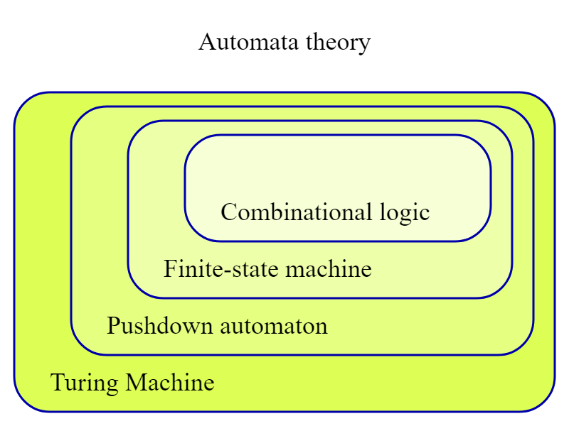

# Theoretical Computer Science

Theoretical computer science examines the problems that can be solved using computational models and algorithms, focusing on their efficiency and solvability. Alan Turing is considered as the father of computer science. He formalized the concept of a **Turing machine**, which is a simple description of a general-purpose computer. A Turing machine consists of an _infinitely long tape_ divided into cells containing symbols, a _head_ that can read and write symbols, a _state register_ that stores the head's state, and a list of possible instructions.

- **Computability Theory** : It studies the general properties of computation, including _decidability_ (Related to the solvability of a problem; meaning there will be an algorithm that returns a 'Yes' or 'no' for any given input.), _computability_ (It investigates whether a problem can be solved with any algorithm in a finite amount of time.), and _Turing completeness_. It addresses what problems can be solved on a computer.

- **Automata Theory and Formal Language Theory** : Automata theory studies abstract machines (automata) and the computational problems they can solve. It is closely linked to formal language theory, which examines the properties of formal languages and their relationship to automata. 

- **Computational complexity theory** : This field examines how efficiently problems can be solved, considering resources like time and memory.

    - **Time and space complexity**: Measures the time and memory required to solve a problem as a function of input size, using asymptotic notation such as `O(n)`, `Ω(n)`, and `Θ(n)`.
    
    - **Classes of problems**: Problems are classified into complexity classes based on their difficulty.

        - **P (polynomial time)**: Problems that can be solved in polynomial time.

        - **NP (nondeterministic polynomial time)**: Problems for which a solution can be verified in polynomial time. Examples include the Boolean satisfiability problem (SAT), the traveling salesman problem (TSP), and the vertex cover problem.

        - **NP-complete**: The hardest problems in NP, to which all other NP problems can be reduced in polynomial time. A polynomial-time algorithm for any NP-complete problem implies P = NP.

        - **NP-hard**: Problems at least as hard as the hardest NP problems but not necessarily in NP.

### Information theory

This field studies the properties of information and how it can be stored, measured, and communicated.

### Cryptography 

Cryptography involves techniques for secure communication and data protection, designing and analyzing cryptographic algorithms and protocols to ensure data confidentiality, integrity, and authenticity.

### Graph theory 

Graph theory examines the properties and applications of graphs, which model pairwise relationships between objects. It is used in modeling networks, social relationships, and optimization problems.
