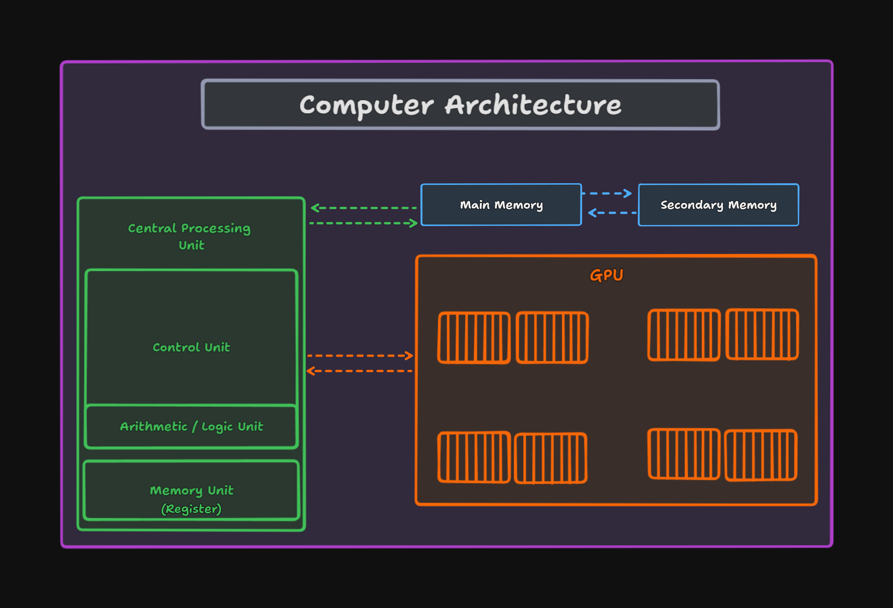
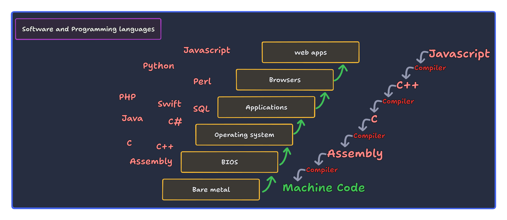

<h1 align="center" style="color: orange"> Computer Science </h1>

Computer science is the study of algorithms, computational systems, and the principles underlying the design of computer hardware and software. It encompasses a wide range of topics, including data structures, algorithms, computer architecture, programming languages, operating systems, artificial intelligence, and more.

## Theoretical computer science

It is a branch of computer science that deals with the formal study of algorithms, computational models, and computational problems. *It focuses on exploring the theoretical limits of what can be computed efficiently.*

- **Theory of computation** : Studies the general properties of computation, including decidability, computability, and Turing completeness. **In short, it studies what problems can be solved algorithmically.**

    - **Turing Machines**: Introduced by Alan Turing in the 1930s, Turing machines are abstract mathematical models of computation. It provide a formal way to describe algorithms and computable functions.

    - **Automata theory**: Studies abstract machines and computational models, such as finite automata, push-down automata, and Turing machines. It provides a theoretical foundation for understanding the capabilities and limitations of computational systems.

- **Computational complexity theory**: Studies the resources required to solve computational problems, such as time, space, and other resources.

    - **Time and space complexity**: Measures the amount of time and space required to solve a problem as a function of the input size.

    - **Classes of problems**: Computational complexity theory classifies problems into various complexity classes based on their inherent difficulty. These classes include **P**, **NP**, **NP-complete**, **NP-hard**, etc. 
        - **P (polynomial time)**: Problems that can be solved in polynomial time.
        
        - **NP (nondeterministic polynomial time)**: Problems for which a solution can be verified in polynomial time. 
        > *If someone claims to have a solution to an NP problem, we can quickly verify whether the solution is correct using polynomial time. However, finding the solution itself might be computationally difficult.* Eg. Boolean satisfiability problem (SAT), the traveling salesman problem (TSP), and the vertex cover problem.
        
        - **NP-complete**: If a problem is NP-complete, it means that it is as hard as the hardest problems in NP. The hardest problems in NP, to which all other problems in NP can be reduced in polynomial time. *If a polynomial-time algorithm exists for any NP-complete problem, then polynomial-time algorithms exist for all problems in NP, implying that P = NP.* 

        - **NP-hard**: Problems that are at least as hard as the hardest problems in NP. They may or may not be in NP.
    
    > In summary, P represents problems solvable in polynomial time, NP represents problems verifiable in polynomial time, NP-complete represents the hardest problems in NP, and NP-hard represents problems at least as hard as NP-complete problems.

- **Information theory**: Studies the properties of information and how it can be stored, measured, and communicated.

- **Cryptography**: Studies the techniques for secure communication and data protection. It involves the design and analysis of cryptographic algorithms and protocols to ensure the confidentiality, integrity, and authenticity of data. It is closely related to information theory.

- **Graph theory**: Studies the properties and applications of graphs, which are mathematical structures used to model pairwise relations between objects. It is extensively used in computer science for modeling networks, social relationships, and optimization problems.

- **Computational geometry**: Studies algorithms and data structures for solving geometric problems. It has applications in computer graphics, geographic information systems, and robotics.

- **Quantum computation**: Studies the use of quantum-mechanical phenomena, such as superposition and entanglement, to perform computation. It has the potential to solve certain problems more efficiently than classical computers.

- **Parallel programming**: Studies the techniques for developing programs that can execute multiple tasks simultaneously. It is essential for exploiting the full potential of modern multi-core and distributed computing systems. 

## Computer Engineering

It deals with the design and construction of computer systems and hardware. A computer understands and processes information in the form of digital signals, which are represented as 0s and 1s. We use programming languages to write code (human readable form), which is then translated into machine code (0s and 1s) that the computer can understand and execute.

High level overview of computer architecture would like this:

- Computers store information in memory. Memory is divided into small units called **cells**. typically each holding `8 bits`, known as a **byte**. 

While there's no physical left or right orientation within a computer, we often visualize memory cells as linear, with the high-order end on the left and the low-order end on the right. The high-order bit, or most significant bit, holds significant value in numerical interpretation, while the low-order bit, or least significant bit, holds less weight.

-  For example consider `10110101`; Here he leftmost bit (1) is the most significant bit (MSB) or high-order bit, and the rightmost bit (1) is the least significant bit (LSB) or low-order bit.

- **CPU (Central Processing Unit)**: CPU is the cornerstone of a computer system. It is responsible for executing instructions and performing calculations. 
    - **CPU Cores**: Modern CPUs have multiple cores, each capable of executing instructions independently. This allows for parallel processing and improved performance.
    - **Cache Systems**: Cache is a small, fast memory unit that stores frequently accessed data and instructions to speed up the access.  Modern CPUs typically have a multi-level cache system, usually referred to as L1, L2, and L3 caches. L1 is the smallest and fastest, located closest to the CPU cores, while L3 is usually larger and slower.
    - **Instruction Pipeline**: CPUs use instruction pipelines to execute multiple instructions simultaneously. Each stage of the pipeline performs a specific task, such as fetching instructions, decoding them, and executing them. This doesn’t reduce the time it takes to complete an individual instruction; instead, it increases the number of instructions that can be processed simultaneously. This leads to a significant increase in overall CPU throughput

- Main memory, often termed random access memory (RAM), allows independent access to cells, unlike mass storage systems (hard disk, SSD, etc) that handle data in large blocks. Modern RAM technologies, such as Dynamic RAM (DRAM) or Synchronous DRAM (SDRAM), utilize techniques like refreshing to maintain data integrity. The following diagram illustrates the memory hierarchy in a typical computer system.

High level overview of the software and programming languages would look like this:

### Information representation and Boolean operations

Information is represented in computers as 0s and 1s, known as bits. These bits can be used to represent numbers, letters, pictures, sounds, and more. The smallest unit of information is a bit, and a group of 8 bits is called a byte. A byte can represent 256 different values `(2^8)`. A byte can also represent a single character in the ASCII character set. 

- Bits represented as 0s and 1s, signify false and true values. Boolean operations are used to manipulate bits, which are the building blocks of digital information.

- A gate is a device that generates the output of a Boolean operation based on its input values. In modern computers, gates are typically made as small electronic circuits where 0s and 1s are represented by different voltage levels. They serve as the fundamental components upon which computers are built.

- The most common gates are AND, OR, and NOT. These gates can be combined to create more complex operations. For example, an XOR gate outputs true if the number of true inputs is odd.

By manipulating bits using Boolean operations, we can perform arithmetic, logical, and other operations on digital information. This forms the basis of computer operations and programming. We generally do not work with bits directly but use higher-level programming languages that abstract these operations. It is like we use a calculator to perform arithmetic operations without worrying about the underlying circuitry. We provide some instructions to a complex program called a compiler, which translates our code into machine code that the computer can execute.

### Programming languages

Programming languages are formal languages used to communicate instructions to a computer. They allow us to write code that can be executed by a computer to perform specific tasks. Programming languages can be classified into several categories based on their design and intended use.

- **Low-level languages**: These languages are close to the hardware and provide direct control over the computer's resources. They are difficult to read and write but offer high performance and efficiency. Examples include assembly language and machine code.

- **High-level languages**: These languages are designed to be easy to read and write, making them more accessible to programmers. They are further divided into several categories:

    - **Procedural languages**: These languages focus on procedures or functions that perform specific tasks. Examples include C, Pascal, and Fortran.
    
    - **Object-oriented languages**: These languages organize code into objects that interact with each other. Examples include Java, C++, and Python.
    
    - **Functional languages**: These languages treat computation as the evaluation of mathematical functions and avoid changing state or mutable data. Examples include Haskell, Lisp, and ML.
    
    - **Scripting languages**: These languages are designed for automating tasks and are often used for web development, system administration, and data analysis. Examples include JavaScript, Python, and Ruby.

- **Domain-specific languages (DSLs)**: These languages are designed for specific domains or tasks, such as SQL for database queries, HTML for web development, and MATLAB for scientific computing.

- **Compiled vs. interpreted languages**: Programming languages can be compiled or interpreted. Compiled languages are translated into machine code before execution, while interpreted languages are translated into machine code during execution. Then there are languages that use a combination of both techniques. Both compiled and interpreted languages have their advantages and disadvantages and the way they are executed are pretty complex.

- **Syntax and semantics**: Programming languages have syntax and semantics that define the rules for writing valid code and the meaning of that code. Syntax refers to the structure of the code, while semantics refer to its meaning. Syntax errors occur when the code violates the language's rules, while semantic errors occur when the code does not behave as expected.

- **Paradigms**: Programming languages are based on different programming paradigms, such as imperative, declarative, functional, and object-oriented. Each paradigm has its own set of concepts and principles for writing code.

### Algorithms and data structures

Algorithms are step-by-step procedures for solving problems. They are the building blocks of computer programs and are essential for writing efficient code. Data structures are ways of organizing and storing data to facilitate efficient access and modification. They are used in conjunction with algorithms to solve computational problems.
