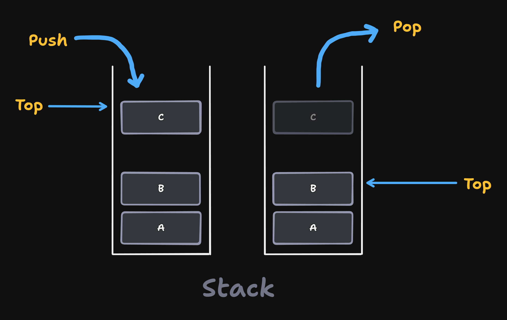

<h1 align="center"> Stack </h1>



A stack is a linear data structure that follows the Last In First Out (LIFO) principle. The last element that is added to the stack is the first one to be removed. The operations of a stack are performed at one end of the stack, which is known as the top of the stack. The operations of a stack are:

1. **Push**: Adds an element to the top of the stack.
2. **Pop**: Removes an element from the top of the stack.
3. **Peek**: Returns the top element of the stack without removing it.
4. **isEmpty**: Returns true if the stack is empty, else false.
5. **length**: Returns the number of elements in the stack.

Stack is used in various applications such as:

1. **Function Call Stack**: The function call stack is used to store the return address of the function calls.

2. **Expression Evaluation**: The stack is used to evaluate infix, postfix, and prefix expressions.

3. **Backtracking**: The stack is used to store the state of the system to backtrack to the previous state.

4. **Undo Operation**: The stack is used to store the previous state of the system to undo the operations.

5. **Balanced Parentheses**: The stack is used to check the balanced parentheses in an expression.

6. **Reverse operations**: We can use a stack to reverse the order of operations.

7. **Browser History**: The stack is used to store the history of the web pages visited by the user.

Overflow and underflow conditions can occur in a stack. Overflow occurs when we try to push an element into a full stack, and underflow occurs when we try to pop an element from an empty stack. In most programming languages like C++, Java, and Python, the stack is implemented using a dynamic array or a linked list; hence overflow is not a common issue.

In python we can use the `list` data structure to implement a stack. The `append()` method is used to push an element into the stack, and the `pop()` method is used to pop an element from the stack. Python's `Collections` module provides a `deque` class that can be used to implement a stack.

- Python also provides a `LifoQueue` class in the `queue` module that can be used to implement a stack. It is thread-safe and can be used in a multithreaded environment.

### Implementations

1. **Using Arrays/List**: In this implementation, we use an array to store the elements of the stack. The top of the stack is represented by the index of the last element in the array. The operations of the stack are performed by manipulating the index of the top element.

```python
class Stack:
    def __init__(self):
        self.stack = []

    def push(self, data):
        self.stack.append(data)

    def pop(self):
        if self.isEmpty():
            return None
        return self.stack.pop()

    def peek(self):
        if self.isEmpty():
            return None
        return self.stack[-1]

    def isEmpty(self):
        return len(self.stack) == 0

    def size(self):
        return len(self.stack)

    def clear(self):
        self.stack = []
```

2. **Using Linked List**: In this implementation, we use a linked list to store the elements of the stack. The top of the stack is represented by the head of the linked list. The operations of the stack are performed by manipulating the head of the linked list.

```python
class Node:
    def __init__(self, data):
        self.data = data
        self.next = None

class Stack:
    def __init__(self):
        self.head = None

    def push(self, data):
        new_node = Node(data)
        new_node.next = self.head
        self.head = new_node

    def pop(self):
        if self.isEmpty():
            return None
        temp = self.head
        self.head = self.head.next
        return temp.data

    def peek(self):
        if self.isEmpty():
            return None
        return self.head.data

    def isEmpty(self):
        return self.head is None

    def size(self):
        count = 0
        temp = self.head
        while temp:
            count += 1
            temp = temp.next
        return count

    def clear(self):
        self.head = None
```

3. **Using Deque**: In this implementation, we use the `deque` class from the `collections` module to implement a stack.

```python
from collections import deque

class Stack:
    def __init__(self):
        self.stack = deque()

    def push(self, data):
        self.stack.append(data)

    def pop(self):
        if self.isEmpty():
            return None
        return self.stack.pop()

    def peek(self):
        if self.isEmpty():
            return None
        return self.stack[-1]

    def isEmpty(self):
        return len(self.stack) == 0

    def size(self):
        return len(self.stack)

    def clear(self):
        self.stack.clear()


stack = Stack()
stack.push(1)
stack.push(2)
stack.push(3)
print(stack.pop())  # 3
print(stack.peek())  # 2
print(stack.size())  # 2
print(stack.isEmpty())  # False
stack.clear()
print(stack.isEmpty())  # True
```

- `deque` is based on a doubly linked list.

### Time Complexity

The time complexity of list based approach is as follows:

1. **Push**: `O(1)`
2. **Pop**: `O(1)`
3. **Peek**: `O(1)`
4. **isEmpty**: `O(1)`
5. **Search**: `O(n)`
6. **Size**: `O(1)`
7. **Clear**: `O(1)`

It is amortized case `O(1)` for all operations. While the deque based has worst case time complexity of `O(1)` for all operations. But list implementation is simple and also cache friendly.
