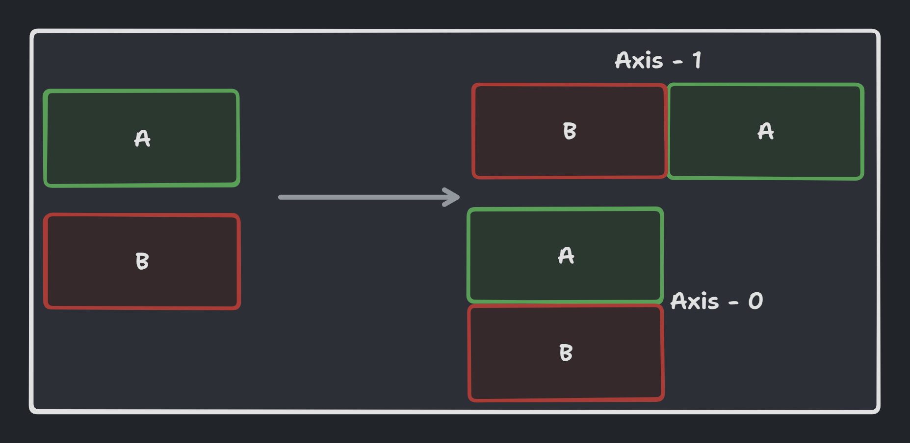

<h1 align="center" style="color: orange"> Pandas </h1>

Pandas is a python library that makes working with “relational” or “labeled” data both easy and intuitive. While learning pandas always keep in mind that they are a type of specialized-complex-powerful dictionary. It is excellent for the following types of data:

- Tabular data with heterogeneously-typed columns, as in an SQL table or Excel spreadsheet

- Ordered and unordered (not necessarily fixed-frequency) time series data.

- Arbitrary matrix data (homogeneously typed or heterogeneous) with row and column labels

- Any other form of observational / statistical data sets. The data need not be labeled at all to be placed into a pandas data structure

It provides two primary data structures: 1-Dimensional `Series` and 2-Dimensional `DataFrame`. Some things pandas does well are;

- Handling missing data

- Size mutability (can insert and delete columns and rows)

- Powerful and flexible `group-by` functionalities

- Ability to work with flat files, Excel files, databases, HDFS formats, and many other data formats

- Time series specific functionalities

**Axis 0 $\rightarrow rows$ and Axis1 $\rightarrow columns$**

## Pandas Series and DataFrame

A Series is a one-dimensional array-like object containing a sequence of values (of similar types to NumPy types) and an associated array of data labels, called its index. It is important to understand that a series index can be non-numbers also. 

We can have two types of indices: implicit and explicit. Implicit indices are the default indices that pandas use. They are also called positional indices. They can be numbers only. We use specialized indexer called `iloc` for implicit indexing.

 Explicit indices are the ones that we assign to the series. It can be numbers, strings, or any other data type. They are known as labels. By default pandas use explicit indices for indexing (`df[2]`) and implicit indices for slicing (`df[2:5]`). We use specialized indexer called `loc` for explicit indexing. 

 These two types of indexing becomes extremely important when we have to deal with duplicate indices.

## Important functions

- `pd.read_csv()` - Read a comma-separated values (csv) file into DataFrame.

    >  `pd.read_excel(), pd.read_sql(), pd.read_json()` 

- `df.head()` - Return the first n rows.
    > `df.tail()` 

- `df.shape` - Return a tuple representing the dimensionality of the DataFrame.

- `df.info()` - Print a concise summary of a DataFrame.

- `df.describe()` - Generate descriptive statistics. 

> Not a good idea to rely heavily on this as it can be prone to many issues.

- `df.columns` - Return the column labels of the DataFrame. `df.keys()` also works similarly.

- `df.values` - Return a Numpy representation of the DataFrame.

- `df.dtypes` - Return the dtypes in the DataFrame.

- `df.isnull()` - Return a boolean same-sized object indicating if the values are NA. NA values, such as None or numpy.NaN, gets mapped to True values.

- `df.drop()` - Drop specified labels from rows or columns.

- `df.dropna()` - Remove missing values.

- `df.fillna()` - Fill NA/NaN values using the specified method.

- `df.replace()` - Replace values given in to_replace with value.

- `df.astype()` - Cast a pandas object to a specified dtype dtype.

- `df.rename({'old_name': 'New_Name'}, axis=1, inplace=True)` - Alter axes labels.

- `df.sort_values()` - Sort by the values along either axis.

- `df.groupby()` - Group DataFrame or Series using a mapper or by a Series of columns.

- `df[col_name].unique()` - Return unique values of Series object.

- `df[col_name].value_counts()` - Return a Series containing counts of unique values.

- `df[col_name].nunique()` - Return number of unique elements in the object.

- `df.concat()` - Concatenate pandas objects along a particular axis with optional set logic along the other axes.

