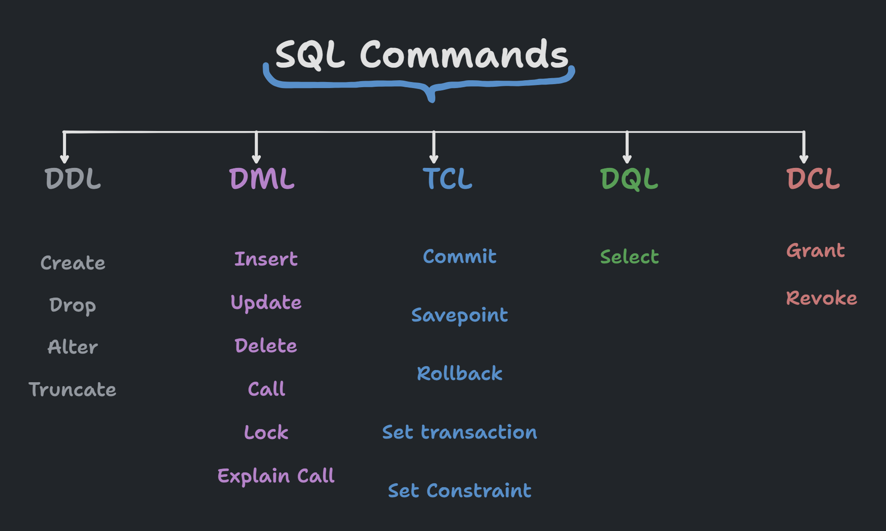
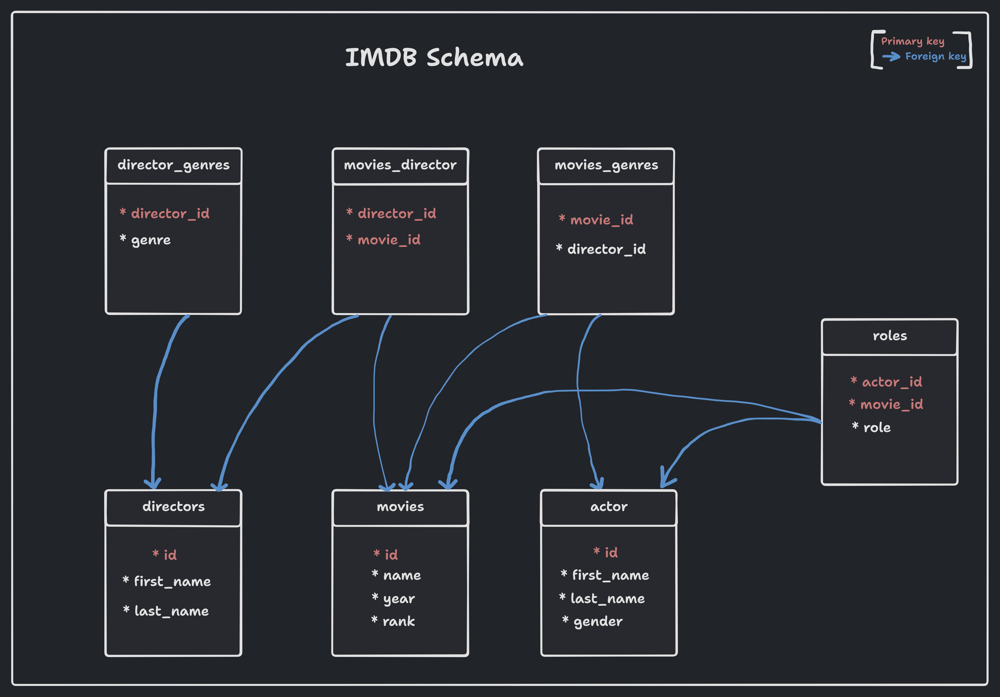
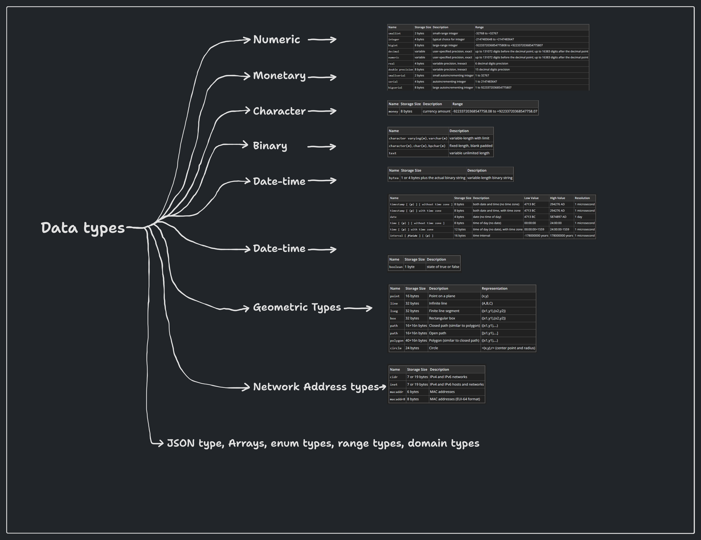

<h1 align='center'> SQL </h1>

SQL stands for Structured Query Language. It is the standard language used for interacting with relational databases. SQL is a declarative language, meaning you specify what you want to do, and the database management system determines how to execute the operation efficiently.

## Basic terminology

Understanding SQL requires familiarity with some fundamental terms used in relational databases:

1. **Data Value**: A single unit of data. Each entry in a table corresponds to a data value.
    - Example: `1`, `03/09/2016`, `A_1`, etc.

2. **Record**: A collection of related data values. Each **row** in a table represents a record.

3. **Field**: A single unit of information. Each **column** in a table represents a field.

4. **File**: A collection of related records. In the context of a database, a **table** can be considered a file.

## Overview of how SQL queries work


1. **Query Submission**: The user submits a query to the database.

1. **Syntax Parsing**: The database parses the query and checks for syntax errors.

1. **Schema Validation**: The database verifies the query against the database schema to ensure the referenced tables and columns exist.

1. **Optimization**: The database determines the most efficient way to execute the query.

1. **Execution**: The database executes the query and returns the results.

> **Result Set**: Whenever a SQL query is executed, the database generates a new table from the existing table(s). This newly generated output is called a result set (a set of rows with column names and some metadata).

## Database schema

A schema in a database refers to the organization and structure of the data. It serves as a blueprint for how the database is constructed, defining all the tables and the relationships between them.

- Formal Definition: A database schema is a set of formulas or integrity constraints imposed on a database to maintain its structure and enforce rules.

## SQL Commands



1. **DDL (Data Definition Language)** : Used to define and modify the database schema.

>  CREATE, ALTER, DROP, TRUNCATE, COMMENT, RENAME

2. **DML (Data Manipulation Language)** : Used for managing data within schema objects (e.g., performing queries, updates).

> SELECT, INSERT, UPDATE, DELETE

**DCL (Data Control Language)** : Used to control access to data in the database.

> GRANT, REVOKE

**TCL (Transaction Control Language)** : Used to manage changes made by DML statements, ensuring data integrity.

> COMMIT, ROLLBACK, SAVEPOINT

To understand database schema better, consider the schema for the `IMDB` dataset:



---

## SQL Query Syntax

The syntax of SQL queries can vary slightly depending on the database engine being used (e.g., MySQL, PostgreSQL, SQLite). Below are examples of common SQL commands with variations for different database engines.

### 1. Show All Available Databases

To list all databases available on the server:

- **PostgreSQL (PSQL):**

  ```sql
  -- Command-line
  \l
  -- or using SQL
  SELECT datname FROM pg_database;
  ```

- **MySQL:**
  ```sql
  SHOW DATABASES;
  ```

### 2. Connect to a Database

To switch to a specific database:

- **PostgreSQL (PSQL):**
  ```sql
  \c DBNAME
  ```
  > In most PostgreSQL client applications, the database is selected when establishing the connection rather than using a separate SQL command.

- **MySQL:**
  ```sql
  USE DBNAME;
  ```

### 3. Show Tables in a Database

To list all tables within the currently connected database:

- **PostgreSQL (PSQL):**
  ```sql
  -- Command-line
  \dt
  ```

- **MySQL:**
  ```sql
  SHOW TABLES;
  ```

### 4. Create a Database

To create a new database:

- **General Syntax (Applicable in both PostgreSQL and MySQL):**
  ```sql
  CREATE DATABASE imdb;
  ```

### 5. Show Schema of a Table

To display the structure of a specific table:

- **PostgreSQL (PSQL):**
  ```sql
  -- Basic schema
  \d TABLENAME
  
  -- Detailed schema
  \d+ TABLENAME
  ```

- **MySQL:**
  ```sql
  DESCRIBE TABLENAME;
  ```

### 6. Selecting Data from a Table

To retrieve data from a table:

- **Select All Columns:**
  ```sql
  SELECT * FROM TABLENAME;
  ```

- **Select Specific Columns:**
  ```sql
  SELECT COLUMN1, COLUMN2 FROM TABLENAME;
  ```

### 7. Creating a Table

To define a new table within the database:

```sql
CREATE TABLE TABLENAME (
    COLUMN1 DATATYPE,
    COLUMN2 DATATYPE,
    COLUMN3 DATATYPE
);
```

- **Example:**
  ```sql
  CREATE TABLE employees (
      id INT,
      name VARCHAR(100),
      hire_date DATE
  );
  ```

### 8. Data Manipulation Language (DML) Commands

DML commands are used for managing data within tables.

- **Inserting Data into a Table:**
  ```sql
  INSERT INTO TABLENAME (COLUMN1, COLUMN2) VALUES (VALUE1, VALUE2), (VALUE3, VALUE4);
  ```

  - **Example:**
    ```sql
    INSERT INTO employees (id, name) VALUES (1, 'John Doe'), (2, 'Jane Smith');
    ```

- **Inserting Data from Another Table (Using a Subquery):**
  ```sql
  INSERT INTO phone_book2
  SELECT *
  FROM phone_book
  WHERE phone_number = '1234567890';
  ```

- **Updating Data in a Table:**
  ```sql
  UPDATE TABLENAME
  SET COLUMN1 = VALUE1, COLUMN2 = VALUE2
  WHERE COLUMN3 = VALUE3;
  ```

  - **Example:**
    ```sql
    UPDATE employees
    SET name = 'John Smith'
    WHERE id = 1;
    ```

- **Deleting Data from a Table:**
  ```sql
  DELETE FROM TABLENAME
  WHERE COLUMN1 = VALUE1;
  ```

  - **Example:**
    ```sql
    DELETE FROM employees
    WHERE id = 2;
    ```

### 9. Limiting Results in SQL

The `LIMIT` clause is used to restrict the number of rows returned by a query.

- **Getting the First 10 Rows:**
  ```sql
  SELECT Column1, Column2
  FROM TABLENAME
  LIMIT 10;
  ```

- **Getting the Next 10 Rows After the First 10:**
  ```sql
  SELECT Column1, Column2
  FROM TABLENAME
  LIMIT 10 OFFSET 10;
  ```

### 10. Ordering Results in SQL (Sorting)

The `ORDER BY` clause is used to sort the result set based on one or more columns.

- **Sorting in Ascending Order:**
  ```sql
  SELECT Column1, Column2
  FROM TABLENAME
  ORDER BY Column1 ASC;
  ```

- **Sorting in Descending Order:**
  ```sql
  SELECT Column1, Column2
  FROM TABLENAME
  ORDER BY Column1 DESC;
  ```

> **Note:** The output row order may not be the same as the order in which rows are inserted into the database. This order depends on the query optimizer, database engine, and the indexes on the table.

### 11. Retrieving Unique Values with `DISTINCT`

The `DISTINCT` keyword is used to return only unique values from a column.

- **Getting Unique Values from a Column:**
  ```sql
  SELECT DISTINCT Column1
  FROM TABLENAME;
  ```

### 12. Filtering Data with `WHERE`

The `WHERE` clause filters rows based on specific conditions.

- **Equality Check:**
  ```sql
  SELECT * 
  FROM TABLENAME 
  WHERE Column1 = 1;
  ```

- **Range Check:**
  ```sql
  SELECT * 
  FROM TABLENAME 
  WHERE Column1 BETWEEN 1 AND 10;
  ```

- **Handling NULL Values:**
  ```sql
  SELECT column1, column2 
  FROM TABLENAME 
  WHERE column2 IS NOT NULL;
  ```

### 13. Using Logical Operators

Logical operators in SQL help combine multiple conditions.

- **AND Operator:**
  ```sql
  SELECT * 
  FROM TABLENAME 
  WHERE Column1 = 1 AND Column2 = 2;
  ```

- **OR Operator:**
  ```sql
  SELECT * 
  FROM TABLENAME 
  WHERE Column1 = 1 OR Column2 = 2;
  ```

- **NOT Operator:**
  ```sql
  SELECT * 
  FROM TABLENAME 
  WHERE NOT Column1 = 1;
  ```

- **BETWEEN Operator:**
  ```sql
  SELECT * 
  FROM TABLENAME 
  WHERE Column1 BETWEEN 1 AND 10;
  ```

- **IN Operator:**
  ```sql
  SELECT column1 
  FROM TABLENAME 
  WHERE Column1 IN (1, 2, 3);
  ```

- **LIKE Operator:**
  - **Pattern Matching:**
    ```sql
    -- To get rows where Column1 starts with 'A':
    SELECT * 
    FROM TABLENAME 
    WHERE Column1 LIKE 'A%';
    ```

  - **Wildcard Matching:**
    ```sql
    -- To get rows where Column1 contains 'A':
    SELECT * 
    FROM TABLENAME 
    WHERE Column1 LIKE '%A%';

    -- To get rows where Column1 starts with 'A', ends with 'A', and has exactly 3 characters in between:
    SELECT * 
    FROM TABLENAME 
    WHERE Column1 LIKE 'A___A';
    ```

### 14. Using Aggregate Functions

Aggregate functions perform a calculation on a set of values and return a single value.

- **Count:**
  ```sql
  SELECT COUNT(*) 
  FROM TABLENAME;
  ```

- **Sum:**
  ```sql
  SELECT SUM(Column1) 
  FROM TABLENAME;
  ```

- **Minimum:**
  ```sql
  SELECT MIN(Column1) 
  FROM TABLENAME;
  ```

- **Maximum:**
  ```sql
  SELECT MAX(Column1) 
  FROM TABLENAME;
  ```

- **Average:**
  ```sql
  SELECT AVG(Column1) 
  FROM TABLENAME;
  ```

### 15. Grouping Data with `GROUP BY`

The `GROUP BY` clause groups rows that have the same values in specified columns into summary rows.

- **Counting Unique Values:**
  ```sql
  SELECT column1, COUNT(column1) AS col1_count
  FROM TABLENAME 
  GROUP BY column1 
  ORDER BY col1_count;
  ```

### 16. Filtering Groups with `HAVING`

The `HAVING` clause is used to filter groups based on aggregate functions.

- **Filtering Groups with a Count Greater Than 1:**

  ```sql
  SELECT column1, COUNT(column1) AS col1_count
  FROM TABLENAME 
  GROUP BY column1 
  HAVING col1_count > 1 
  ORDER BY col1_count;
  ```

- **Difference Between `WHERE` and `HAVING`:**

  - `WHERE` filters individual rows before grouping.
  - `HAVING` filters groups after grouping.

---

### 17. Joins in SQL

<!-- TODO: CORRECT THE BELOW IMAGE.. -->
<!--   -->

Joins are used to combine rows from two or more tables based on a related column between them.

- **Inner Join:**

  Returns only the rows where there is a match in both tables.
  ```sql
  SELECT * 
  FROM TABLENAME1 
  INNER JOIN TABLENAME2 
  ON TABLENAME1.Column1 = TABLENAME2.Column1;
  ```

- **Left Join (or Left Outer Join):**

  Returns all rows from the left table, and the matched rows from the right table. Rows from the left table with no match in the right table will have `NULL` values for columns from the right table.
  ```sql
  SELECT * 
  FROM TABLENAME1 
  LEFT JOIN TABLENAME2 
  ON TABLENAME1.Column1 = TABLENAME2.Column1;
  ```

- **Right Join (or Right Outer Join):**
  Returns all rows from the right table, and the matched rows from the left table. Rows from the right table with no match in the left table will have `NULL` values for columns from the left table.
  ```sql
  SELECT * 
  FROM TABLENAME1 
  RIGHT JOIN TABLENAME2 
  ON TABLENAME1.Column1 = TABLENAME2.Column1;
  ```

- **Full Outer Join:**

  Returns all rows when there is a match in one of the tables. Rows from both tables with no match will have `NULL` values for the columns from the table without a match.
  ```sql
  SELECT * 
  FROM TABLENAME1 
  FULL OUTER JOIN TABLENAME2 
  ON TABLENAME1.Column1 = TABLENAME2.Column1;
  ```
- **Join Conditions:** Ensure that the columns used for joining are indexed to improve performance.

- **Avoid Cartesian Products:** Be cautious with joins that do not have proper conditions, as they may result in a Cartesian product, returning a large number of rows.

- **Natural Join:** Automatically joins tables based on columns with the same names. Note that it’s less explicit and might lead to unexpected results if tables have columns with the same name but different meanings.
```sql
SELECT * 
FROM TABLENAME1 
NATURAL JOIN TABLENAME2;
```

---

### 18. Subqueries in SQL

Subqueries are queries nested within another query, used to perform operations that depend on the results of the inner query.

- **Basic Subquery:**
  Retrieves rows from one table based on the results from another table.
  ```sql
  SELECT column1, column2 
  FROM TABLENAME 
  WHERE some_id IN (
    SELECT column3 
    FROM TABLENAME2 
    WHERE column4 = 'some_value'
  );
  ```

- **Use Aliases:** Simplify your queries and improve readability by using table aliases.
```sql
SELECT A.Column1, B.Column2 
FROM TABLENAME1 A 
INNER JOIN TABLENAME2 B 
ON A.Column1 = B.Column1;
```

- **Nested Code Blocks:** Treat subqueries as nested code blocks where the inner query is executed first, and its result is used in the outer query. This approach can simplify complex queries.

- **Performance Considerations:** Subqueries can be less efficient than joins. For better performance, consider using joins or optimizing subqueries as needed.

- **Correlated Subqueries:** When the subquery references columns from the outer query, it’s called a correlated subquery. Use these when you need to perform row-by-row comparisons.

- **Readability:** Ensure subqueries are well-structured and commented to maintain readability, especially in complex queries.

### 19. Combining Results with `UNION`

The `UNION` operator combines the results of two or more `SELECT` statements, removing duplicate rows by default. Use `UNION ALL` to include duplicates.

- **Union:**
  Combines results and removes duplicate rows.
  ```sql
  SELECT column1 
  FROM TABLENAME1 
  UNION 
  SELECT column1 
  FROM TABLENAME2;
  ```

- **Union All:**
  Combines results and includes duplicate rows.
  ```sql
  SELECT column1 
  FROM TABLENAME1 
  UNION ALL 
  SELECT column1 
  FROM TABLENAME2;
  ```

- **Performance:** `UNION ALL` is generally faster than `UNION` because it does not perform duplicate checking.

- **Order By Clause:** If you need to sort the combined result, use an `ORDER BY` clause at the end of the combined query.

### 20. Working with Views

Views are virtual tables created from the result of a query. They simplify complex queries and provide a layer of abstraction.

- **Creating a View:**
  ```sql
  CREATE VIEW view_name AS
  SELECT column1, column2 
  FROM TABLENAME 
  WHERE column1 = 'some_value';
  ```

- **Selecting Data from a View:**
  ```sql
  SELECT * 
  FROM view_name;
  ```

- **Deleting a View:**
  ```sql
  DROP VIEW view_name;
  ```

- **Performance Considerations:** Views themselves do not store data. They are executed when queried, so performance depends on the underlying query.

- **Use Cases:** Views are useful for encapsulating complex joins and aggregations or for providing different perspectives on the same data.

### 21. Using Indexes

Indexes improve the speed of data retrieval operations on a database table. They are particularly useful for columns that are frequently used in search conditions.

- **Creating an Index:**
  ```sql
  CREATE INDEX index_name 
  ON TABLENAME (column1);
  ```

- **Deleting an Index:**
  ```sql
  DROP INDEX index_name;
  ```

- **Automatic Indexes:** Indexes are automatically created for primary key columns and unique constraints.

- **Performance Impact:** While indexes speed up data retrieval, they can slow down data modification operations (INSERT, UPDATE, DELETE) because the index needs to be updated.

- **Indexing Strategy:** Use indexes judiciously. Indexes on columns used in WHERE clauses, JOIN conditions, and ORDER BY clauses are usually beneficial.

### 22. Data Definition Language (DDL) in SQL

DDL commands are used to define and modify database structures.

- **Creating a Table:**
  ```sql
  CREATE TABLE TABLENAME (
      column1 datatype,
      column2 datatype,
      column3 datatype
  );
  ```

- **Deleting a Table:**
  ```sql
  DROP TABLE TABLENAME;
  ```

- **Adding a Column:**
  ```sql
  ALTER TABLE TABLENAME 
  ADD COLUMN column1 datatype;
  ```

- **Deleting a Column:**
  ```sql
  ALTER TABLE TABLENAME 
  DROP COLUMN column1;
  ```

- **Changing a Column's Data Type:**
  ```sql
  ALTER TABLE TABLENAME 
  ALTER COLUMN column1 datatype;
  ```

- **Renaming a Column:**
  ```sql
  ALTER TABLE TABLENAME 
  RENAME COLUMN column1 TO column2;
  ```

- **Renaming a Table:**
  ```sql
  ALTER TABLE TABLENAME 
  RENAME TO TABLENAME2;
  ```

- **Dependencies:** Be aware of dependencies such as foreign keys and views that may be affected by DDL changes.

### 23. Data Control Language (DCL) in SQL

DCL commands are used to control access to data within the database. They manage permissions for users and roles.

- **Granting Privileges:**
  Use the `GRANT` statement to give specific privileges to a user or role.
  ```sql
  GRANT privilege_name 
  ON TABLENAME 
  TO user_name;
  ```

- **Revoking Privileges:**
  Use the `REVOKE` statement to remove specific privileges from a user or role.
  ```sql
  REVOKE privilege_name 
  ON TABLENAME 
  FROM user_name;
  ```


- **Privilege Types:** Common privileges include `SELECT`, `INSERT`, `UPDATE`, `DELETE`, and `ALL PRIVILEGES`. The `ALL PRIVILEGES` grants all available permissions on the specified object.

- **Role Management:** Consider using roles to manage permissions for groups of users, simplifying privilege management.

---

**Data-types in SQL (PostgreSQL specific)**



**Constraints in SQL**

Constraints are used to specify rules for the data in a table. If there is any violation between the constraint and the data action, the action is aborted. Constraints can be column level or table level. 

The following constraints are commonly used in SQL:

- `NOT NULL` - Ensures that a column cannot have a NULL value

- `UNIQUE` - Ensures that all values in a column are different

- `PRIMARY KEY` - A combination of a NOT NULL and UNIQUE. Uniquely identifies each row in a table

- `FOREIGN KEY` - Prevents actions that would destroy links between tables

- `CHECK` - Ensures that the values in a column satisfies a specific condition

- `DEFAULT` - Sets a default value for a column if no value is specified

- `INDEX` - Used to create and retrieve data from the database very quickly

## Postgres with Python

Use the [`psycopg2`](https://www.psycopg.org/psycopg3/docs/) library to connect to the database and execute queries.

```python
import psycopg2

# Connect to the database
conn = psycopg2.connect("dbname=imdb user=postgres password=postgres")

# Create a cursor object
cur = conn.cursor()

# Execute a query
cur.execute("SELECT * FROM movies LIMIT 10")

# Fetch the results
results = cur.fetchall()

# Print the results
for row in results:
    print(row)

# Close the cursor
cur.close()

# Close the connection
conn.close()
```

## MySQL with Python

Use the `mysql-connector-python` library to connect to the database and execute queries.

```python

import mysql.connector


# Connect to the database
conn = mysql.connector.connect(
    host="localhost",
    user="root",
    password="password",
    database="imdb"
)

# Create a cursor object
cur = conn.cursor()

# Execute a query
cur.execute("SELECT * FROM movies LIMIT 10")

# Fetch the results
results = cur.fetchall()

# Print the results
for row in results:
    print(row)

# Close the cursor
cur.close()

# Close the connection
conn.close()
```

