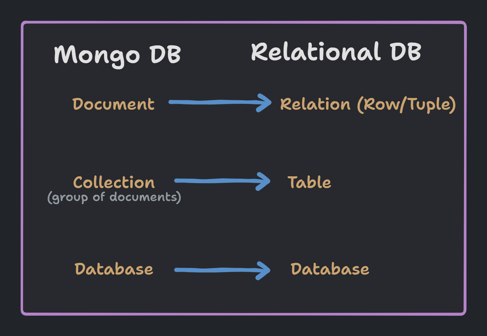

<h1 align="center"> MongoDB </h1>

MongoDB is a NoSQL, document-based, and distributed database. Unlike relational databases, which have fixed schemas that can be difficult and costly to change once the database is in production, MongoDB offers a flexible schema design. This flexibility reduces the need for computationally expensive joins and group-by operations, making MongoDB particularly suitable for applications with evolving data structures.


MongoDB stores data in the form of documents, specifically BSON (Binary JSON). BSON is a binary-encoded format of JSON that extends the JSON model by providing additional data types, maintaining the order of fields, and optimizing the encoding and decoding process across different programming languages.



In MongoDB, you can also embed one document inside another, which can be useful for representing hierarchical data structures.

## MongoDB Syntax

- **`mongosh`**: Opens the MongoDB shell.
  
- **`show dbs`**: Lists all databases.
  
- **`use <db_name>`**: Switches to the specified database.
  
- **`db`**: Displays the current database.
  
- **`show collections`**: Lists all collections in the current database.
  
- **`db.<collection_name>.insertOne({<document>})`**: Inserts a single document into the specified collection.

```javascript
  db.user.insertOne({name: "John Doe", age: 25});
```
  Here, `db` refers to the current database, `user` is the collection name, and `name` and `age` are fields within the document. You can also use `insertMany` to insert multiple documents or `insert` for legacy support.

- **`db.<collection_name>.find()`**: Retrieves all documents from the specified collection.

- **`db.createCollection(<collection_name>)`**: Creates a new collection in the current database.

### The `_id` Field

MongoDB automatically adds an `_id` field to every document, which serves as the default primary key. The `_id` field is a 12-byte hexadecimal number composed of:

- **First 4 bytes**: Timestamp
- **Next 3 bytes**: Machine identifier
- **Next 2 bytes**: Process identifier
- **Last 3 bytes**: Counter, randomly generated

The `_id` field is indexed by default and is immutable. You can specify your own `_id` field if needed.

### Write Concern and Journaling

- **`db.col.insertOne({some_data}, {writeConcern: {w: "majority", j: true, wtimeout: 2000}})`**:
  - `w` specifies the write concern level (e.g., `"majority"` requires acknowledgment from a majority of nodes).
  - `j` ensures the write operation is recorded in the journal.
  - `wtimeout` sets the timeout duration (e.g., 2000 milliseconds). If the operation is not successful within this time, it will be dropped.

### Query Execution and Optimization

- **`find().explain("executionStats")`**: Provides execution statistics for a query, including the number of documents scanned and returned. This is useful for understanding query performance and optimizing queries.

### Python Driver

- **`pymongo`**: The Python driver for MongoDB, allowing you to interact with MongoDB databases using Python.

---