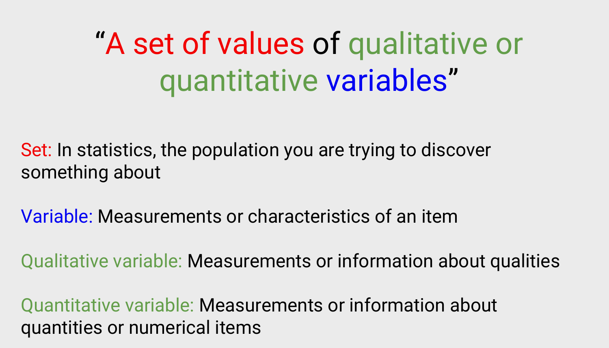

# Descriptive Analysis

Descriptive Analysis involves examining data to gain insights into **_past or current events_** within a data environment. This is often achieved through data visualization techniques and summary statistics. It is also known as **Exploratory data analysis**. Before that, first let us understand what is data.

**Data: The Foundation of Data Science** 🧩

> This is the most comprehensive definition I could found.

Data, in essence, consists of factual information, encompassing numbers, words, measurements, observations, etc. It can be categorized into two primary types: **qualitative** and **quantitative**.

Qualitative data provides descriptive insights, characterizing aspects of a subject, while quantitative data comprises numerical information that can be precisely measured or counted. Data serves as the raw material that can be processed to extract valuable information.

Descriptive analysis involves the following techniques:

1. Summary Statistics
2. Visualization and Distributions
3. Correlation analysis
4. Hypothesis testing
5. Sampling and Resampling
6. Dimensionality reduction
