<!-- 
    Author : Kannan Jayachandran
    File : Probability.md     
 -->

<h1 align="center" style="color: orange"> PROBABILITY </h1>

## Table of Contents   

1. [Experiment](#experiment)
1. [Outcome](#outcome)
1. [Sample Space](#sample-space)
1. [Event](#event)
1. [Event Space](#event-space)
1. [Random Variable](#random-variable)
1. [Calculating Probability](#calculating-probability)
1. [Probability Distribution](#probability-distribution)
1. [Density functions](#density-functions)
1. [Probability Density Function (PDF)](#probability-density-function-pdf)
1. [Probability Mass Function (PMF)](#probability-mass-function-pmf)
1. [Cumulative Density Function (CDF)](#cumulative-density-function-cdf)
1. [Symmetric Distribution and Skewness](#symmetric-distribution-and-skewness)
1. [Kurtosis](#kurtosis)
1. [Gaussian Distribution or Normal Distribution](#gaussian-distribution-or-normal-distribution)
1. [Empirical rule or 68–95–99.7 rule](#empirical-rule-or-68–95–99.7-rule)
1. [Standard Normal Variate](#standard-normal-variate)
1. [Quantile-Quantile (QQ) Plot](#quantile-quantile-qq-plot)
1. [Student's t-distribution or t-distribution](#students-t-distribution-or-t-distribution)
1. [Uniform Distribution](#uniform-distribution)
1. [Standard uniform distribution](#standard-uniform-distribution)
1. [Binomial Distribution](#binomial-distribution)
1. [Bernoulli Distribution](#bernoulli-distribution)
1. [Lognormal Distribution](#Log-Normal-Distribution)
1. [Pareto Distribution](#pareto-distribution)

---

$\color{orange}``$**_Probability is a measure that quantifies the likelihood that an event will occur._**$\color{orange}"$

---

## Experiment 

The process which produces an outcome.

- _For instance, when we flip a coin, flipping the coin can be considered as the experiment_.

## Outcome 

An outcome is the result of an experiment. 

- _For example, if we toss a coin, the outcome can be either heads or tails_.

## Sample Space (Ω or S) 

The sample space is the set of all possible outcomes (or events) of a random experiment. 

- In the case of a coin toss, the sample space is {heads, tails} or when rolling a fair six-sided die, the sample space is {1, 2, 3, 4, 5, 6}.

## Event (A)

An outcome of an experiment to which a probability is assigned (can also be a collection of outcomes). It is a subset of the sample space.

- _For example, when tossing a coin, the event of getting a head is a subset of the sample space. $\color{#F99417}\{h\}\subset \{h, t\}$. We use the intersection ($\color{#F99417}\cap$) of both events when they both occur, and the union ($\color{#F99417}\cup$) when either of them occurs_.

## Event space (F) 📆

The collection of all possible events. It is a subset of the sample space that consists of specific outcomes or combinations of outcomes

For example, if we toss a coin, the event space is {∅, {head}, {tails}, {head, tails}} or the event of getting an even number when rolling the die, the event space would be {2, 4, 6}

## Probability function (P)

The function used to assign a probability to an event.

## Random Variable (X) 🔢

A random variable is a variable that can assume various values, and the specific value it takes is subject to chance or randomness. They are of two types; `discrete` and `continuous`. **Discrete random variables** can be represented by a **probability distribution table**, while **continuous random variables** can be represented by a **probability density function**.

| Discrete Random Variable | Continuous Random Variable |
| :----------------------: | :------------------------: |
| A random variable which represents outcomes that can be counted or enumerated and are typically associated with countable or distinct values (Typically whole numbers) .| A random variable which represents outcomes that can be measured and can take on any value in a given range (Any real number) . | 
|       Whole number       |         Real number        |
|       Countable set      |       Uncountable set      |
|       Finite set         |         Infinite set       |

## Ven diagram of probability representation

## Calculating Probability

Generally we would calculate probability by using the following idea;

$$P(E) = \frac{\texttt {Number of favorable outcomes}}{\texttt{Total number of possible outcomes}}$$

And probability would always turns out to be a number between 0 and 1. Where 0 indicates impossibility and 1 indicates certainty.

 <b> Example </b> 

_Now consider the following experiment of throwing a fair-six-faced die. {1, 2, 3, 4, 5, 6}. Compute the probability that you get a number that is; less than 5 and an even number._

- `Sample space` : {1, 2, 3, 4, 5, 6}

- `Events` : $\color{#F99417}E_1$ = {1, 2, 3, 4} and $\color{#F99417}E_2$ = {2, 4, 6}

- `Event space` : $\color{#F99417}F$ = {$\color{#F99417}E_1$, $\color{#F99417}E_2$} $\rightarrow$ $\color{#F99417} E_1 \cap E_2$  = {2, 4}

$$P(E) = \frac{2}{6} = \frac{1}{3}$$

The above equation of P(E) essentially tells us what probability is; **Probability is a measure of the size of a set**. If you understand this, you're sort of done with probability. This is what I would call the essence of probability.

We have a sample space $\color{#F99417}S$ and an event space $\color{#F99417}F$, all probability does is represent the event space relative to the sample space as a ratio. So in turn we are measuring the size of the event space relative to the sample space.

Hence we can define probability as `a measure of the size of a set`

---

## Compliment of Probability

The complement of an event is the set of all outcomes in the sample space that are not in the event. It is denoted as $\color{#F99417}A^c$ or $\color{#F99417}A'$. The probability of the complement of an event is given by;

$$P(A^c) = 1 - P(A)$$

## Probability Distribution

A probability distribution is a mathematical function that describes how the values of a random variable are distributed or spread out. It can be used to represent both discrete (discrete probability distribution) and continuous (continuous probability distribution) random variables. 

> The distribution of individual data points is referred to as the `data distribution`, while the distribution of a sample statistic is known as the `sampling distribution`.

## Probability Density Function (PDF)

The Probability Density Function, or **PDF** also called (Density Function), calculates the probability of observing a given outcome within a continuous probability distribution. PDF is calculated for continuos random variables. PDF's always satisfy the following two conditions;

1. Always be non-negative $\color{#F99417}f(x) \ge 0$ for all $\color{#F99417}x$

2. The total area under the PDF curve over the entire range of possible values is equal to $\color{#F99417}1$.

The probability of a  random variable ($\color{#F99417}X$) falling within a small interval, say $\color{#F99417}[a, b]$, is given by the integral of the PDF over that interval.

$$P(a\le x \le b) = \int_{a}^{b}f(x)dx$$

> PDF of Gaussian distribution

- The integral of the density function over a specific interval gives the probability that the random variable falls within that interval.

The PDF curve represents the probability density of the random variable at each point. This means that the area under the PDF curve between two points represents the probability of the random variable taking on a value within that range.

**We can calculate PDF using the following steps**;

1. Find the probability distribution and the parameters of the distribution.

2. Get the PDF formula for the distribution and calculate.

## Probability Mass Function (PMF)

Probability mass function (PMF) is a function that gives the probability of a discrete random variable taking on a specific value. It is denoted as $\color{#F99417}P(X=x)$. It provides the probability of $\color{#F99417}X$ taking on a specific value.

The PMF must satisfy the following two conditions:

1. For all possible values of $\color{#F99417}x$, $\color{#F99417}P(X=x)\ge 0$.

2. The sum of the PMF over all possible values of $\color{#F99417}x$ is equal to $\color{#F99417}1$.

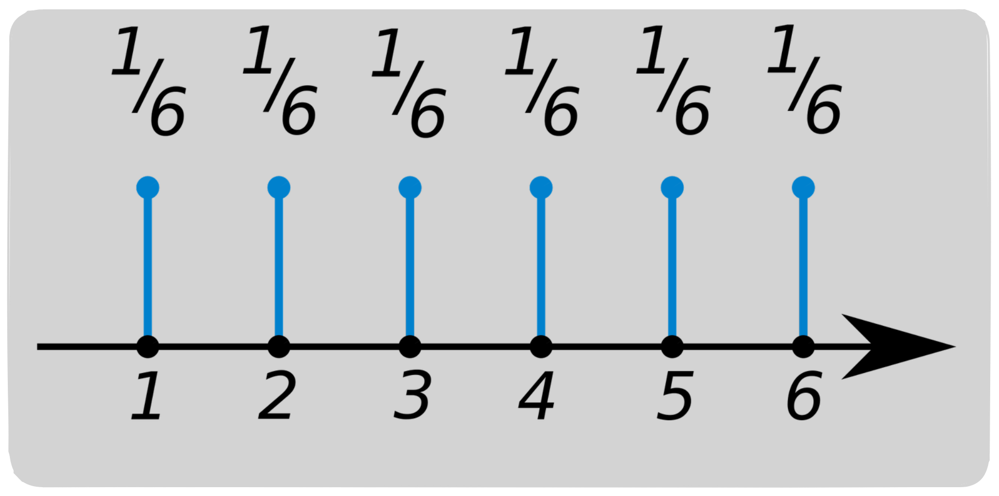

## Cumulative Density Function (CDF)

Calculates the probability of an observation equal or less than a value. It is also called  `cumulative distribution function`. It calculates the cumulative likelihood.

$$F(x) = P(X\le x)$$

We can calculate CDF of a continuous random variable by integrating the PDF of the random variable and for a discrete random variable, we can calculate CDF by summing up the probabilities of all possible outcomes that are less than or equal to $\color{#F99417}x$.

> CDF of Gaussian distribution 

- CDF is a monotonically increasing function (non-decreasing). That is; as $\color{#F99417}x$ increases, $\color{#F99417}F(x)$ can only increase or remain the same.

- As shown in the above diagram, CDF in a normal distribution is a smooth `S` shaped curve.

## Symmetric Distribution and Skewness

A distribution is considered **symmetric** when the right half of the distribution is a mirror image of the left half. This means that the number of data points on one side is equal to the number on the other. An example of a symmetric distribution is the `normal distribution`.

A distribution is said to be **skewed** if the right half of the distribution is not a mirror image of the left half. In this case, the number of data points on one side is not equal to the other side.  For example, the `exponential distribution` is skewed. There are two types of skewness;

1. **Right Skewed or Positive Skewed** : If the right tail is longer than the left tail, the distribution is said to be right skewed. Here **mean** is greater than the **median**. 

2. **Left Skewed or Negative Skewed** : If the left tail is longer than the right tail, the distribution is said to be left skewed. In this case, the **mean** is less than the **median**.

> Skewness is a measure asymmetry of the distribution.

## Kurtosis

Kurtosis provides insights into the peakedness of a distribution and measures the heaviness of the tails of a distribution.

From the image above, you can observe that higher kurtosis indicates a greater peakedness in the distribution.

- The normal distribution has a kurtosis of 3, making it a **mesokurtic** distribution.

- A distribution with a kurtosis of less than 3 is classified as a **platykurtic** distribution.

- A distribution with a kurtosis greater than 3 is referred to as a **leptokurtic** distribution.

> We compare Kurtosis coefficient, to determine the kurtosis of a distribution (Meso, Platy, Lepto).

## Gaussian Distribution or Normal Distribution ($\color{#F99417}X\sim N(\mu, \sigma)$)

The Gaussian distribution, also known as the Normal distribution, is one of the most common and important probability distributions. It is characterized by a bell-shaped curve and described by two key parameters: the mean ($\color{#F99417}\mu$) and the standard deviation ($\color{#F99417}\sigma$).  Mathematically we would write a normal distribution as;

$$X\sim N(\mu, \sigma)$$

We denote normal distribution as $\color{#F99417}N(\mu, \sigma)$ or  $\color{#F99417}N(\mu, \sigma^2)$, where $\color{#F99417}\sigma^2$ is the variance of the distribution. It is a continuous distribution.

We can write the **PDF** of a normal distribution as; 

$$\large f(x) = \frac{1}{\sigma\sqrt{2\pi}}e^{-\frac{1}{2}(\frac{x-\mu}{\sigma})^2}$$

where $\color{#F99417}\large \frac{1}{\sqrt{2\pi}\sigma}$ is the normalization constant, $e$ is the base of the natural logarithm, $\color{#F99417}\large \frac{x-\mu}{\sigma}$ is the standard score or z-score.

> z-score is the standard score or standard value of a random variable. It is the number of standard deviations that a data point is above from the mean. It is denoted as $\color{#F99417}z$.

The **CDF** of a normal distribution is given by;

$$\large F(x) = {\displaystyle \Phi ({\frac {x-\mu }{\sigma }})={\frac {1}{2}}\left[1+\operatorname {erf} \left({\frac {x-\mu }{\sigma {\sqrt {2}}}}\right)\right]}$$

Where $\color{#F99417}erf$ is the error function. We can rewrite this equation as;

$$\large F(x) = \frac{1}{\sigma\sqrt{2\pi}}\int_{-\infty}^{x}e^{-\frac{1}{2}(\frac{x-\mu}{\sigma})^2}dx$$
 
Gaussian distribution is important as it is the  distribution of many natural phenomena. For example, the height of people, the weight of people, the marks of students in a class, etc. are all normally distributed.

|Property | Notation/Formula |
|:---:|:---:|
|Mean | $\color{#F99417}\mu$ |
|Median | $\color{#F99417}\mu$ |
|Mode | $\color{#F99417}\mu$ |
|Standard Deviation | $\color{#F99417}\sigma$ |
|Variance | $\color{#F99417}\sigma^2$ |
|Skewness | $\color{#F99417}0$ |

## Empirical rule or 68–95–99.7 rule

The Empirical Rule is a statistical guideline that applies to a normal distribution, stating that almost all data points will fall within three standard deviations of the mean.

Let's consider a normal distribution $\color{#F99417}X \sim N(\mu, \sigma^2)$, with $\color{#F99417}\mu = 0$. Then we can say that;

1. Around $\color{#F99417}68\%$ of the data lies within $\color{#F99417}\mu \pm \sigma$ $\color{#F99417}[-1\sigma, 1\sigma]$.

2. Around $\color{#F99417}95\%$ of the values lie within $\color{#F99417}\mu \pm 2\sigma$ $\color{#F99417}[-2\sigma, 2\sigma]$.

3. Around $\color{#F99417}99.7\%$ of the values lie within $\color{#F99417}\mu \pm 3\sigma$ $\color{#F99417}[-3\sigma, 3\sigma]$.

**[1 $\sigma$ = 68%]**

**[2 $\sigma$ = 95%]**

**[3 $\sigma$ = 99.7%]**

## Standard Normal Variate

A standard normal variate is a random variable that follows a normal distribution with a mean of zero and a standard deviation of one. It is denoted as $\color{#F99417}Z$. 

$$\large z\sim N(0, 1)$$

The process of converting a normal distribution to a standard normal distribution is called **standardization**. 

Let us consider the iris dataset, with `PetalLengthCm` as one feature. We can represent this feature as a normal distribution as follows; 

$$X \sim N(\mu, \sigma^2)$$ 

where $\color{#F99417}X$ can take any value in the range $\color{#F99417}[x_1, x_2, ..., x_{50}]$. We can standardize this distribution as;

$\large x_i$' = $\large \frac{x_i - \mu}{\sigma} \;\;\forall \;i= 1, 2, .., 50$ 

where $\color{#F99417}\large x_i'$ is the standardized value of $\color{#F99417}\large x_i$. Now we can write the standardized distribution as;

$$X` \sim N(0, 1)$$

where $\color{#F99417}X`$ can take any value in the range $\color{#F99417}[x_1`, x_2`, ..., x_{50}`]$.

## Quantile-Quantile (QQ) Plot

QQ plot is a graphical technique for easily determining whether a random variable is Gaussian or normally distributed. Consider the random variable $\color{#F99417}x$, with samples/observations $\color{#F99417}\bar x_1, \bar x_2, \bar x_3, ...\bar x_n$.

- First sort them in ascending order. $\color{#F99417}\bar x`_1, \bar x`_2, \bar x`_3, ...\bar x`_n$.

- Calculate the percentile. $\color{#F99417}x^{(1)}, x^{(2)}, x^{(3)}, ...x^{(n)}$. We get the first percentile at $\color{#F99417}\bar x`_{\frac{n}{100}}$

> If we have 100 data points, then the first percentile is the first data point. If we have 1000 data points, then the first percentile is the 10th data point.

- Create $Y \sim N(0, 1)$, where $\color{#F99417}Y$ is a random variable that follows a standard Gaussian distribution, with mean $\color{#F99417}\mu = 0$ and standard deviation $\color{#F99417}\sigma = 1$.

- Create $\color{#F99417}n$ observations from the $\color{#F99417}Y$ distribution. Sort them in ascending order and find the percentile. $\color{#F99417}y^{(1)}, y^{(2)}, y^{(3)}, ...y^{(n)}$. These are also called `theoretical quantiles`.

- Now plot the $\color{#F99417}x^{(i)}$ vs $\color{#F99417}y^{(i)}$.

If the plot is a straight line (approx.), then the random variable $\color{#F99417}x$ is normally distributed.

> Q-Q plot can also help us in determining whether we have same distributions; given two random variables $\color{#F99417}x$ and $\color{#F99417}y$.

## Student's t-distribution or t-distribution ($\color{#F99417}t(\nu)$)

The t-distribution is a continuous probability distribution that serves as a generalization of the normal distribution. It shares the symmetry around zero and bell-shaped characteristics with the normal distribution but exhibits heavier tails. The t-distribution commonly arises in statistical inference, particularly when estimating the mean of a normal distribution with samples of different sizes.

$$\large\text{data }= \frac{x - \mu(x)}{\frac{S}{\sqrt{n}}}$$

Where $\color{#F99417}S$ is the sample standard deviation, $\color{#F99417}n$ is the sample size and $\color{#F99417}\mu(x)$ is the sample mean. The degrees of freedom $\color{#F99417}\nu$ is equal to $\color{#F99417}n-1$.

We can write the PDF of t-distribution as;

$$\large f(x) = \frac{\Gamma(\frac{\nu + 1}{2})}{\sqrt{\nu\pi}\Gamma(\frac{\nu}{2})}(1 + \frac{x^2}{\nu})^{-\frac{\nu + 1}{2}}$$

where $\color{#F99417}\Gamma$ is the gamma function. $\color{#F99417}\Gamma$ function is a generalization of the factorial function to non-integer values. It is defined as;

$$\large \Gamma(z) = \int_{0}^{\infty}x^{z-1}e^{-x}dx$$

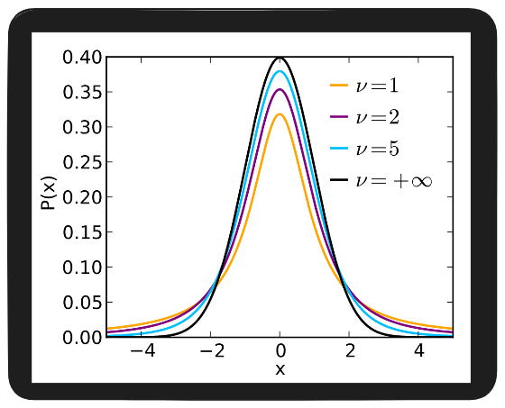

> PDF of t-distribution

We can write the CDF of t-distribution as;

$$\large F(x) = \frac{\Gamma(\frac{\nu + 1}{2})}{\sqrt{\nu\pi}\Gamma(\frac{\nu}{2})}\int_{-\infty}^{x}(1 + \frac{x^2}{\nu})^{-\frac{\nu + 1}{2}}dx$$

where $\color{#F99417}\nu$ is the degrees of freedom, $\color{#F99417} x$ is the random variable and $\color{#F99417}F(x)$ is the CDF of t-distribution.

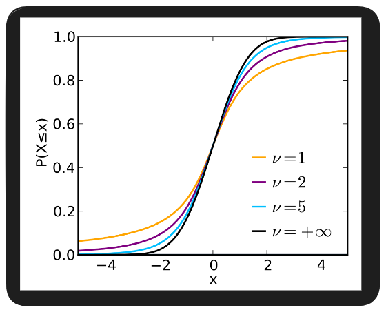

> CDF of t-distribution

|Property | Notation/Formula |
|:---:|:---:|
|Mean | $\color{#F99417}0$ for $\color{#F99417}\nu > 1$ |
|Median | $\color{#F99417}0$ |
|Mode | $\color{#F99417}0$ |
|Standard Deviation | $\color{#F99417}\sqrt{\frac{\nu}{\nu - 2}}$ for $\color{#F99417}\nu > 2$ |
|Variance | $\color{#F99417}\frac{\nu}{\nu - 2}$ for $\color{#F99417}\nu > 2$ |
|Skewness | $\color{#F99417}0$ for $\color{#F99417}\nu > 3$ |
|Kurtosis | $\color{#F99417}\frac{6}{\nu - 4}$ for $\color{#F99417}\nu > 4$ |

**As freedom increases, t-distribution approaches normal distribution.**

## Uniform Distribution

Uniform distributions are probability distributions with equally likely outcomes. It has constant probability. It can be of two types; `discrete uniform distribution` and `continuous uniform distribution`.

In the **discrete uniform distribution**, outcomes are countable and equally likely. That is they have same probability. 

> For example if we toss a fair coin, we will get either heads or tails. Both of these outcomes have the same probability of occurring. We wont get any other outcome.

In continuous uniform distribution, outcomes are continuous and infinite. 

> An example for continuous uniform distribution is a random number generator. 

We can write uniform distribution as $\color{#F99417}X \sim U(a, b)$, where $a$ and $b$ are the two parameters of the uniform distribution ( the lower and upper limits of the distribution).  The probability density function of a uniform distribution is given by;

$$f(x) = \frac{1}{b-a}$$

where $\color{#F99417}a \le x \le b$

**PDF** of a continuous uniform distribution is a horizontal line, which is denoted by; 

$$f(x) = \begin{cases} \frac{1}{b-a} & \text{if } a \le x \le b \\ 0 & \text{otherwise} \end{cases}$$

In terms of $\color{#F99417}\mu$ and $\color{#F99417}\sigma^2$, we can write the PDF as;

$$f(x) = \begin{cases} \frac{1}{2\sigma\sqrt{2}} & \text{for }-\sigma\sqrt{3}\le x - \mu \le \sigma\sqrt{3}\\ 0 &\text{otherwise} \end{cases}$$

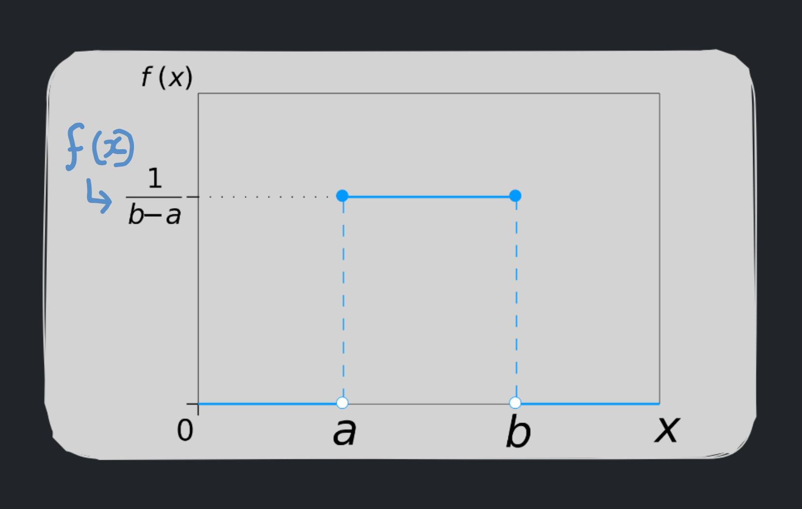

**CDF** of a continuous uniform distribution is given by;

$$F(x) = \begin{cases} 0 & \text{if } x < a \\ \frac{x-a}{b-a} & \text{if } a \le x \le b \\ 1 & \text{if } x > b \end{cases}$$

In terms of $\color{#F99417}\mu$ and $\color{#F99417}\sigma^2$, we can write the CDF as;

$$F(x) = \begin{cases} 0 & \text{for } x-\mu < - \sigma\sqrt{3} \\ \frac{x-\mu + \sigma\sqrt{3}}{2\sigma\sqrt{3}} & \text{for } - \sigma\sqrt{3} \le x - \mu <  \sigma\sqrt{3} \\ 1 & \text{for } x - \mu \ge \sigma\sqrt{3} \end{cases}$$

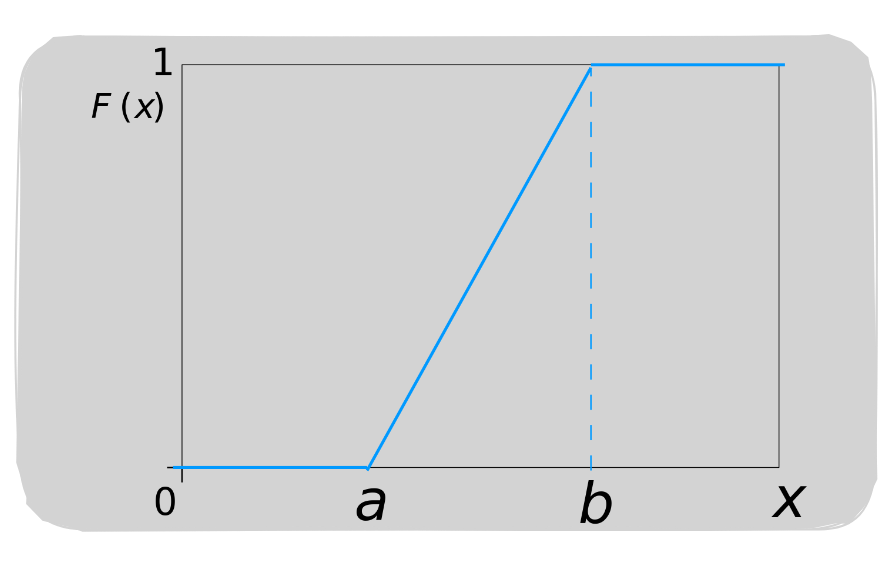

|Property | Notation/Formula |
|:---:|:---:|
|Mean, Median | $\color{#F99417}\frac{a+b}{2}$ |   
| Mode | $\color{#F99417}\texttt{Any value x in (a, b)} $ |
| Variance | $\color{#F99417}\frac{1}{12}(b-a)^2$ |
| Std. Deviation | $\large\color{#F99417}\frac{b-a}{\sqrt{12}}$ |
| Skewness | $\color{#F99417}0$ |
| Number of outcomes (n) | $\color{#F99417}b-a+1$ |
| Probability of each outcome | $\color{#F99417}\frac{1}{n}$ |

## Standard uniform distribution

Continuous uniform distribution with parameters $\color{#F99417}a = 0$ and $\color{#F99417}b = 1$ is called the standard uniform distribution. It is denoted as $\color{#F99417}U(0, 1)$. One interesting property of this distribution is that if $\color{#F99417}u_1$ has a standard uniform distribution, then $\color{#F99417}u_2 = 1 - u_1$ also has a standard uniform distribution. This property is called inversion method, where we can use continuous standard distribution to generate random number $\color{#F99417}x$ from any continuous distribution with CDF $\color{#F99417}F$.

**PMF** of discrete uniform distribution is given by;

$$f(x) = \begin{cases} \frac{1}{n} & \text{for } x = 1, 2, ..., n \\ 0 & \text{otherwise} \end{cases}$$

**CDF** of discrete uniform distribution is given by;

$$F(x) = \begin{cases} 0 & \text{for } x < 1 \\ \frac{x}{n} & \text{for } 1 \le x \le n \\ 1 & \text{for } x > n \end{cases}$$

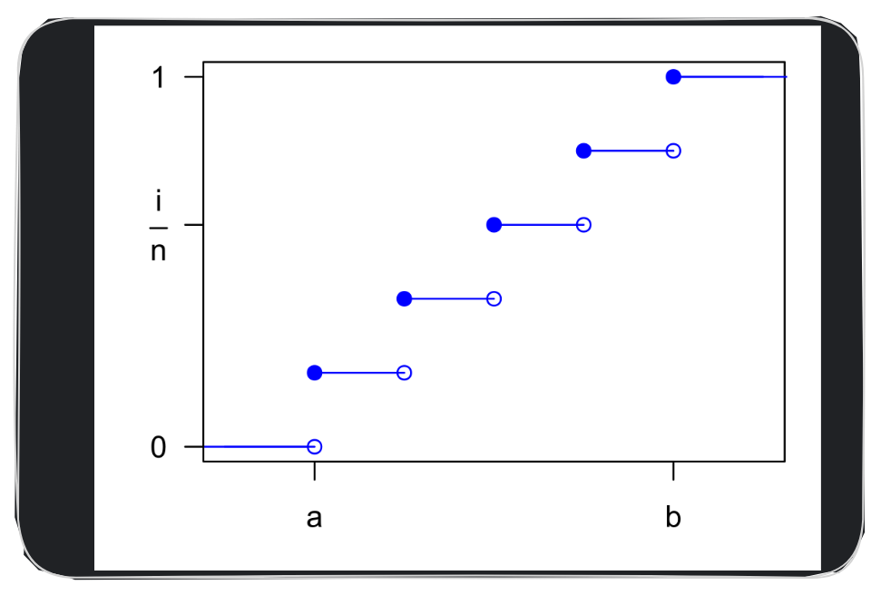

> Uniform distribution is a special case of beta distribution. This makes uniform distribution to be used for modelling a variety of random phenomena.

## Binomial Distribution

Binomial distribution is a _discrete probability distribution_ with parameters : number of trials ($\color{#F99417}n$) and probability of success in each trial ($\color{#F99417}p$), that describes the number of successes in a sequence of $\color{#F99417}n$ independent experiments, each asking a `yes–no` question, and each with its own Boolean-valued outcome: `success or failure`.

A single success/failure experiment is called a `Bernoulli trial` or `Bernoulli experiment`, and a sequence of outcomes is called a `Bernoulli process`. For a single trial, we can write the probability of success as $\color{#F99417}p$ and the probability of failure as $\color{#F99417}q = 1 - p$. And in this case where $\color{#F99417}n=1$, the binomial distribution is a Bernoulli distribution.

We can write binomial distribution as $\color{#F99417}X \sim B(n, p)$. The **PMF** of binomial distribution is given by;

$$f(x) = \begin{cases} \large\binom{n}{x}p^x(1-p)^{n-x} & \text{for } x = 0, 1, ..., n  \end{cases}$$

**where**; 

- $\color{#F99417}\binom{n}{x}$ is the binomial coefficient (which is the number of ways of picking $\color{#F99417}x$ (number of successes) unordered outcomes from $\color{#F99417}n$ possibilities (the number of trials), also known as a combination)

- $\color{#F99417}P$ is the probability of success on a single trial 

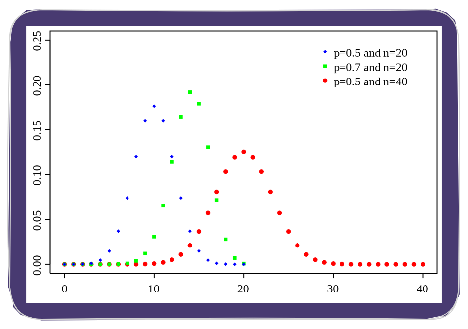

**PMF in binomial distribution gives the probability of getting $\color{#F99417}x$ successes in $\color{#F99417}n$ trials.**

> For example if we flip a coin 5 times and want to know the probability of getting 3 heads (F(3)), we can use the PMF of binomial distribution.

**CDF** of binomial distribution is given by;

$$F(x) = \begin{cases} 0 & \text{for } x < 0 \\ \sum_{k=0}^{x}\binom{n}{k}p^k(1-p)^{n-k} & \text{for } 0 \le x \le n \\ 1 & \text{for } x > n \end{cases}$$

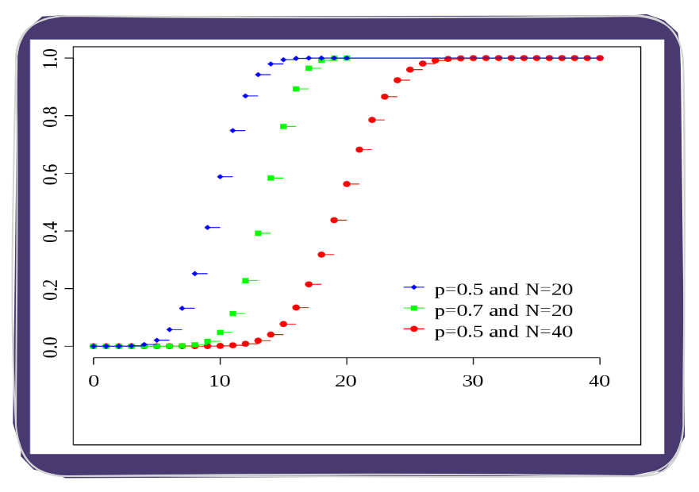

**For binomial distribution CDF gives the the number of successes will be less than or equal to a certain value.**

> For example if we flip a coin 5 times and want to know the probability of getting 3 or fewer heads (F(0) + F(1) + F(2) + F(3)), we can use the CDF of binomial distribution.

|Property | Notation/Formula |
|:---:|:---:|
|Mean & Median | $\color{#F99417}np$ |
|Mode | $\color{#F99417}\lfloor (n+1)p \rfloor$ |
|Variance | $\color{#F99417}npq$ |
|Std. Deviation | $\color{#F99417}\sqrt{np(1-p)}$ |
|Skewness | $\color{#F99417}\frac{q-p}{\sqrt{npq}}$ |

## Bernoulli Distribution

Bernoulli distribution is a `discrete probability distribution` that can have only two possible outcomes. It is a special case of binomial distribution where a single experiment is conducted. It is a discrete distribution with two possible outcomes, `success` and `failure`. It is also called a `two-point distribution` or `two-point random variable`.

We can write Bernoulli distribution as $\color{#F99417}X \sim Bernoulli(p)$, where $p$ is the probability of success. **PMF** of a Bernoulli distribution is given by;

$$f(x) = p^x(1-p)^{1-x}$$

where $x \in \{0, 1\}$.

This can also be interpreted as;

$$PMF = \begin{cases} q & \text{if } k = 0 \\ p & \text{if } k = 1 \end{cases}$$

where $\color{#F99417}q = 1-p$ 

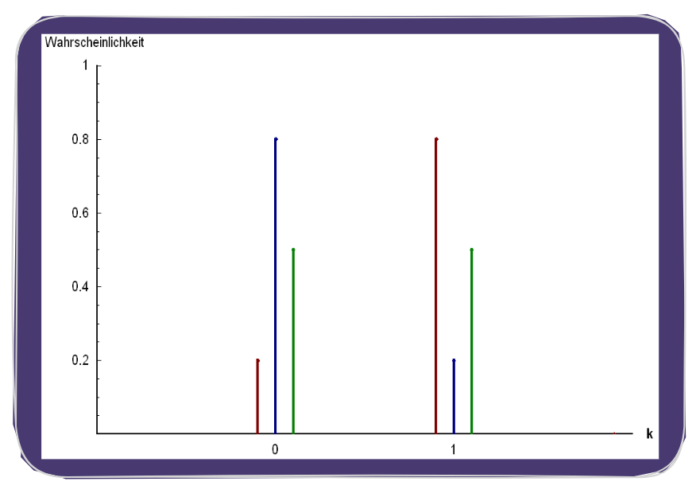

|Property | Notation/Formula |
|:---:|:---:|
|Mean | $\color{#F99417}p$ |
|Median | $\color{#F99417}\begin{cases} 1 & \text{if } p \ge \frac{1}{2} \\ [0, 1] & \text{if } p = \frac{1}{2} \\ 0 & \text{if } p < \frac{1}{2} \end{cases}$ |
|Mode | $\color{#F99417}\begin{cases} 1 & \text{if } p \ge \frac{1}{2} \\ 0, 1 & \text{if } p = \frac{1}{2} \\ 0 & \text{if } p < \frac{1}{2} \end{cases}$ |
|Variance | $\color{#F99417}pq$ |
|Skewness | $\color{#F99417}\frac{q-p}{\sqrt{pq}}$ |

## Log Normal Distribution

The log-normal distribution is a continuous probability distribution that describes a random variable whose natural logarithm follows a normal distribution. In other words, if the random variable $\color{#F99417}X$ follows a log-normal distribution, then the variable $\color{#F99417}Y = \ln(X)$ is normally distributed.

We can write log-normal distribution as $\color{#F99417}X \sim LN(\mu, \sigma^2)$, where $\color{#F99417}\mu$ and $\color{#F99417}\sigma^2$ are the mean and variance of the variable's natural logarithm. The **PDF** of a log-normal distribution is given by;

$$f(x) = \frac{1}{x\sigma\sqrt{2\pi}}e^{-\frac{1}{2}(\frac{ln(x)-\mu}{\sigma})^2}$$

where $x > 0$.

> It is similar to normal distribution, other than the ln(x) term. The PDF curve of a log-normal distribution is skewed to the right.

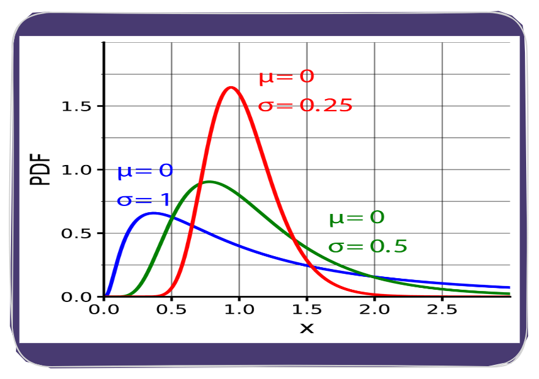

> As $\color{#F99417}\sigma$ increases, the distribution gets more skewed to the right.

**CDF** of a log-normal distribution is given by;

$$F(x) = \frac{1}{2} + \frac{1}{2}erf(\frac{ln(x)-\mu}{\sigma\sqrt{2}})$$

where $x > 0$.

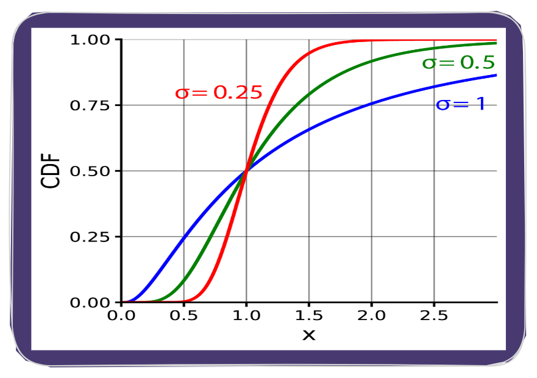

|Property | Notation/Formula |
|:---:|:---:|
|Mean | $\color{#F99417}e^{\mu + \frac{\sigma^2}{2}}$ |
|Median | $\color{#F99417}e^{\mu}$ |
|Mode | $\color{#F99417}e^{\mu - \sigma^2}$ |
|Variance | $\color{#F99417}(e^{\sigma^2}-1)e^{2\mu + \sigma^2}$ |
|Skewness | $\color{#F99417}\frac{e^{\sigma^2}+2}{\sqrt{e^{\sigma^2}-1}}$ |

The log-normal distribution finds applications in various fields, including human behavior, finance, biology, chemistry, hydrology, and social sciences. It is particularly useful in modeling variables like the length of social media comments, user dwell time on a website, or the duration of chess games, among others. 

## Pareto Distribution

Pareto distribution is a continuous probability distribution used to model phenomena where a small number of items or events account for the majority of the impact or occurrences. It is commonly referred to as the "80-20" rule, where approximately 80% of the effects come from 20% of the causes. It is based on `Power Law`.

### Power law

Power law is a functional relationship between two quantities, where a relative change in one quantity results in a proportional relative change in the other quantity, independent of the initial size of those quantities: _**one quantity varies as a power of another**_. For instance, considering the area of a square in terms of the length of its side, if the length is doubled, the area is multiplied by a factor of four.

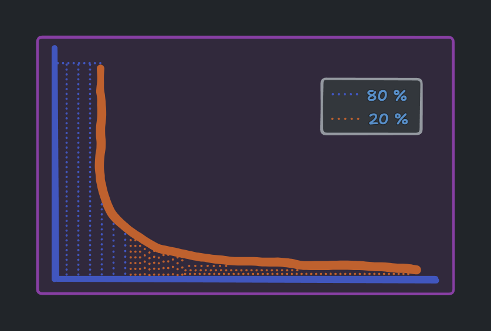

- This is what `pareto principle` also says. It says that 80% of the effects come from 20% of the causes.

We can write a pareto distribution as $\color{#F99417}X \sim Pareto(\alpha, x_m)$, where $\color{#F99417}\alpha$ is the shape parameter and $\color{#F99417}x_m$ is the scale parameter. **PDF** of a pareto distribution is given by;

$$f(x) = \frac{\alpha x_m^\alpha}{x^{\alpha+1}}$$

where $x \ge x_m$ and $\alpha > 0$.

**CDF** of a pareto distribution is given by;

$$F(x) = 1 - (\frac{x_m}{x})^\alpha$$

where $x \ge x_m$ and $\alpha > 0$.

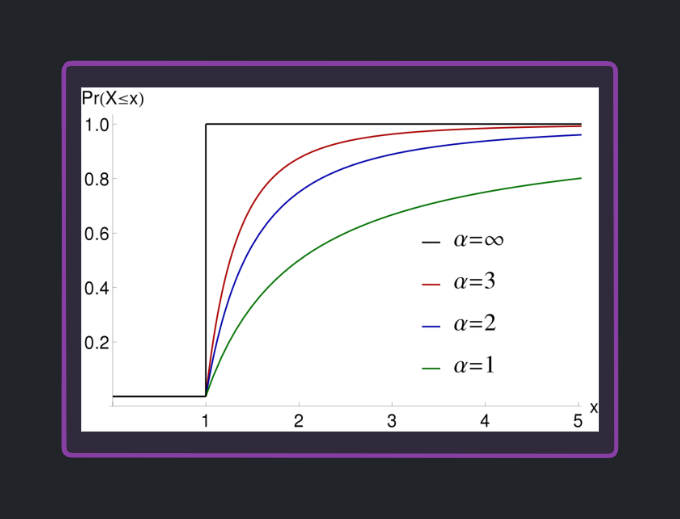

|Property | Notation/Formula |
|:---:|:---:|
|Mean | $\color{#F99417}\begin{cases} \infty & \text{if } \alpha \le 1 \\ \frac{\alpha x_m}{\alpha - 1} & \text{if } \alpha > 1 \end{cases}$ |
|Median | $\color{#F99417}x_m(\frac{1}{2})^{\frac{1}{\alpha}}$ |
|Mode | $\color{#F99417}x_m$ |
|Variance | $\color{#F99417}\begin{cases} \infty & \text{if } \alpha \in (1, 2] \\ \frac{x_m^2\alpha}{(\alpha-1)^2(\alpha-2)} & \text{if } \alpha > 2 \end{cases}$ |
|Skewness | $\color{#F99417}\begin{cases} \text{undefined} & \text{if } \alpha \le 3 \\ \frac{2(1+\alpha)}{\alpha-3}\sqrt{\frac{\alpha-2}{\alpha}} & \text{if } \alpha > 3 \end{cases}$ |

> We can use log-log plot to check if a distribution follows pareto distribution. If the plot is linear, then the distribution follows pareto distribution most of the times (not always). 

---

## Box Cox Transformation

Data transformation involves applying mathematical operations to a dataset without changing its essential characteristics. There are two main types: `linear transformations` and `non-linear transformations`.

**Linear Transformation**: Preserves the linearity of the data and only scales it.

**Non-Linear Transformation**: Alters the shape and distribution of the data using mathematical functions like logarithmic or exponential.

`Power transformation` is a type of non-linear transformation. It involve using a parameter $\color{#F99417}\lambda$ to perform a range of transformations to stabilize the variance of a non-normal distribution. For example taking the square root and the logarithms of observation in order to make the distribution normal belongs to the class of power transforms.

### Box Cox transformation

The Box-Cox transformation is a non-linear technique used to convert a log-normal distribution into a normal distribution and stabilize variance. It exposes the underlying normal distribution in the data without changing its fundamental nature.

We can describe box cox transformation as;

$$Y' = \frac{Y^λ - 1}{\lambda} $$

where $\color{#F99417}Y$ is the response variable and $\color{#F99417}λ$ is the transformation parameter.

Mathematically we can write box cox transformation as;

$$y(\lambda) = \begin{cases} \frac{y^\lambda - 1}{\lambda} & \text{if } \lambda \ne 0 \\ \ln(y) & \text{if } \lambda = 0 \end{cases}$$

where $\color{#F99417}y > 0$.

Selecting the optimal value of $\color{#F99417}\lambda$ is important. We may use maximum likelihood estimation to find the optimal value of $\color{#F99417}\lambda$. Generally we select the value of $\color{#F99417}\lambda$ to be between [$\color{#F99417} -5, 5$]. Common values for $\color{#F99417}\lambda$ are;

| value | Transformation |
|:---:|:---:|
| $\color{#F99417}\lambda = -1$ | reciprocal transformation  |
| $\color{#F99417}\lambda = -0.5$ | reciprocal square root transformation  |
| $\color{#F99417}\lambda = 0$ | log transformation  |
| $\color{#F99417}\lambda = 0.5$ | square root transformation  |
| $\color{#F99417}\lambda = 1$ | no transformation  |
| $\color{#F99417}\lambda = 2$ | square transformation  |

> See the notebook for implementation of box cox transformation using python.

**Limitations of box cox transformation**

- Defined only for strictly positive values of $\color{#F99417}y$.

- It may not fully address situations where data variance is not constant (homoscedasticity assumption).

- It may not always be applicable.

- Selecting an optimal $\color{#F99417}\lambda$ and interpreting the transformed values can be challenging.

<!-- If required add distributions here -->

## Law of Large Numbers

Law of large numbers is a foundational theorem to both probability and statistics. It states that the average result from repeating an experiment multiple times will better approximate the true or expected underlying result. This theorem has important implications in applied machine learning, such as the law of large numbers is critical for understanding the selection of training datasets, test datasets, and in the evaluation of model skill.

Some important terms related to law of large numbers are;

- **Independent and Identically Distributed (IID)** : A sequence of random variables is independent and identically distributed if each random variable has the same probability distribution as the others and all are mutually independent (The result of one trial does not depends on another one).

- **Regression to the mean** : The phenomenon that if a variable is extreme on its first measurement, it will tend to be closer to the average on its second measurement. It is also called **reversion to the mean**.
