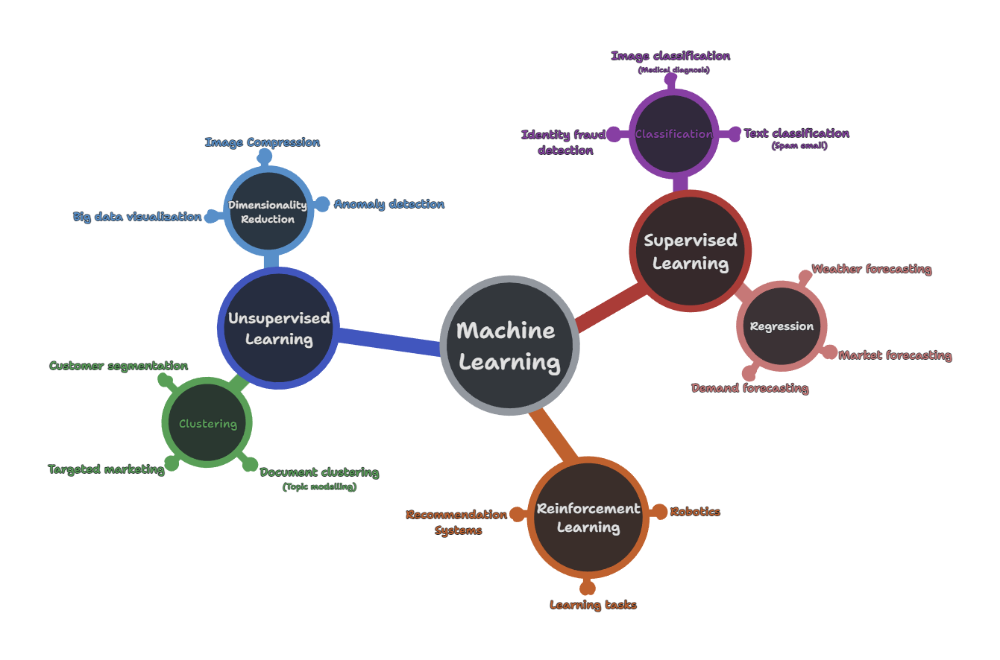

<h1 align="center" style="color: orange"> Data Science - I </h1>

## Table of contents

- [Introduction to Data Science](#introduction-to-data-science)

- [Application of data science](#application-of-data-science)

- [The Data Science Process](#the-data-science-process)
    - [Data](#data)
    
    - [Qualitative and Quantitative data](#qualitative-and-quantitative-data)

- [Artificial Intelligence](#artificial-intelligence)

- [Machine learning](#machine-learning)

- [Deep learning](#deep-learning)

- [Generative AI](#generative-ai)

- [Mathematics for data science and machine learning](#mathematics-for-data-science-and-machine-learning)
    
- [Data visualization](#data-visualization)

---

## Introduction to Data Science

We live in a world drowning in data. Websites, social media platforms, IOT devices,  smartphones, smart cars, smart cooker (yes it exists) and what not, generates an incomprehensible amount of data every day. This enormous amount of data although seems like a ever growing problem, is a gold mine for businesses and organizations as they contains answers to questions that can help them make better decisions, understand their customers better, and improve their products and services.

Data science is the field that deals with extracting insights from data and using it to make informed decisions. It is an interdisciplinary field that combines domain knowledge, statistical and mathematical expertise along with programming skills, to extract insights from data.

## Application of data science

- Retail and E-commerce

- Media and Entertainment

- Banking and Finance

- Education and Research

- Healthcare

- Transportation and Logistics

- Manufacturing

- Energy and Utilities

- Government and Public Sector

## The Data Science Process

The data science process refers to the steps involved in extracting insights from data. It involves the following steps:

1. **Problem definition**: Define the problem you want to solve and frame the questions you want to answer.

2. **Data collection**

3. **Data cleaning and preprocessing**: Clean the data by removing missing values, outliers, and irrelevant data. Pre-process the data by transforming it into a suitable format for analysis.

4. **Exploratory data analysis (EDA)**: Explore the data to understand its characteristics, identify patterns, and visualize relationships between variables.

5. **Feature engineering**: Create new features from the existing data to improve the performance of machine learning models.

6. **Model selection**: Select the appropriate machine learning or statistical model based on the problem you want to solve and the characteristics of the data.

7. **Model training**: Train the model on the training data.

8. **Model evaluation**: Evaluate the performance of the model on the test data.

9. **Model deployment**: Deploy the model to make predictions on new data.

10. **Model monitoring and maintenance**: Monitor the performance of the model over time and update it as needed.

### Data

### Qualitative and Quantitative data

**Quantitative data** is numerical data that can be measured and expressed as numbers. It is further divided into **`discrete`** and **`continuous`** data. Discrete data consists of distinct, separate values, while continuous data  can take on an infinite number of values within a given range.

**Qualitative data** deals with qualities and characteristics that cannot be measured in numerical terms. It is further divided into **`nominal`** and **`ordinal`** data. Nominal data represents categories or labels with no inherent order or ranking. Ordinal data represents categories with a specific order or ranking but does not have a consistent interval between values; That is the differences between ordinal values are not meaningful. 

## Artificial Intelligence

Artificial intelligence (AI) is a branch of computer science that deals with the development of computer systems that can perform tasks typically requiring human intelligence. This involves creating algorithms to classify, analyze, and make predictions based on data. AI systems can also act on data, learn from new information, and continuously improve their performance.

## Machine learning

Machine learning is a subset of artificial intelligence (AI) that deals with developing algorithms and models that enable computers to learn and make predictions or decisions without being explicitly programmed, by consuming data and using statistical analysis to derive insights from it. 

At the core of nearly all machine learning models, including neural networks, is a fundamental mathematical concept; 

> **_Fit a given set of data points to an appropriate function designed to distinguish meaningful patterns in the data from noise and then make sure this function generalizes well and performs effectively on unseen data._**

## Deep learning

Deep learning is a subset of machine learning that uses _artificial neural networks_ (ANNs) to mimic the working of the human brain. It can learn complex representations of data and is used to solve complex problems such as image classification, speech recognition, natural language processing, etc.

## Generative AI

Generative AI is a subset of deep learning that uses deep learning to generate new data. It can be used for creating text,  images, videos, music, etc. Generative AI contributes to the recent resurgence of AI and is used in a wide variety of applications such as image generation, text generation, music generation, etc.

--- 

In this module we will be covering two foundational areas;

- **Mathematics for data science and machine learning**

- **Data visualization** 

## Mathematics for data science and machine learning

- [Linear Algebra for data science and machine learning](./Linear_algebra.md)

- [Probability Theory for data science and machine learning](./Probability.md)

- [Statistics for data science and machine learning](./Statistics.md)

- [Calculus for data science and machine learning](./Calculus.md)

- [Discrete Mathematics for data science and machine learning](./Discrete_Mathematics.md)

## Data visualization

- [Data Visualization for data science and machine learning](./Data_visualization.md)
